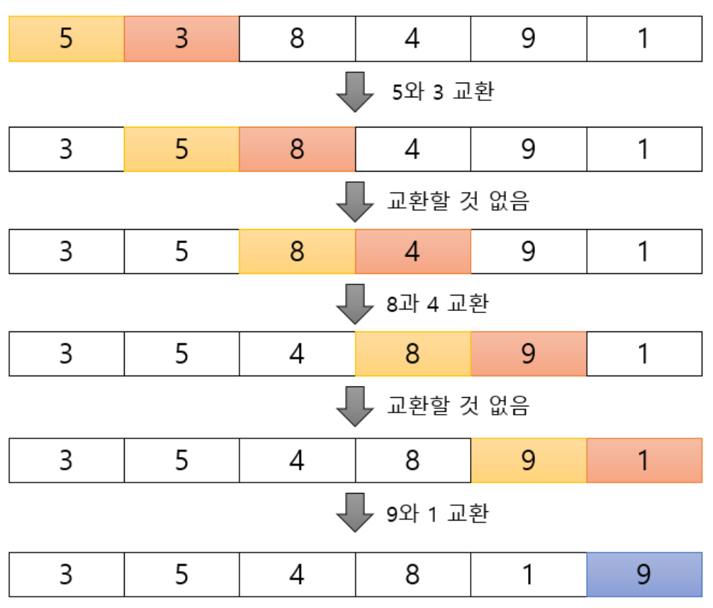
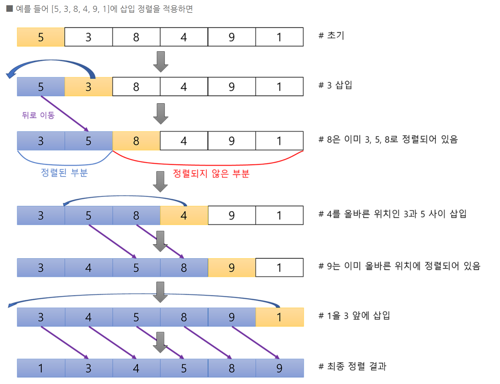
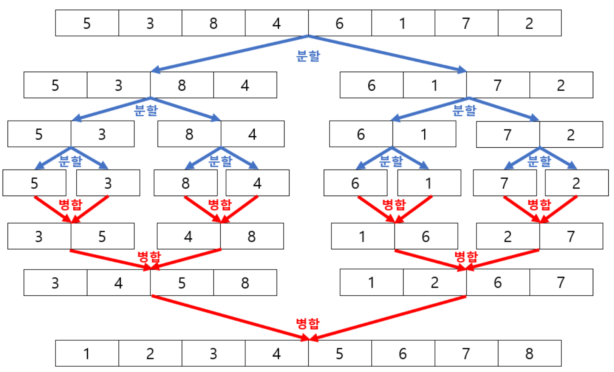
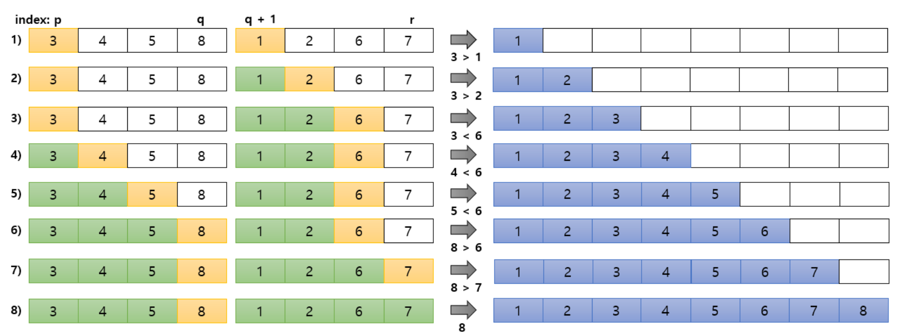

# 알고리즘 - 점근적 표기법과 정렬

> [📚 전체 목차로 돌아가기](../../README.md)

## Table of Contents

- [점근적 표기법](#1-점근적-표기법)
- [시간 복잡도 (Time Complexity)와 공간 복잡도(Space Complexity)](#2-시간-복잡도-time-complexity와-공간-복잡도space-complexity)
- [Sort Algorithm](#3-sort-algorithm)

---

## 1. 점근적 표기법

점근적 표기법에는 크게 $O$(빅오, Big-O), $\Omega$(빅-오메가, Big-Omega), $\Theta$(빅-세타, Big-Theta)가 있다. 

$T(n)$은 분석하려는 함수, $g(n)$은 $T(n)$과 비교하려는 베이스라인 함수이다. 

그리고 $c$는 $n$과 무관함 양의 상수이고 $n_0$는 "이 값 이후부터 부등식이 계속 성립한다"라고 정하는 시작점으로 0보다 큰 값을 사용한다.

다항식 $T(n)=2n^3+3n^2+1$을 예시로 사용하겠다.

### 1.1 $O$ 표기법 (빅-오)
$O$ 표기법은 주어진 함수(이 예시의 경우 $T(n)$)의 상한을 나타낸다. 이는 함수의 성장 속도가 특정 함수보(이 예시의 경우 $g(n)$)보다 같거나 느리다는 것을 의미한다.
정리하면, $O(g(n))$을 통해 $T(n)$이 위쪽으로 얼마나 커질 수 있는가를 확인하기 위한 것이다. 

- 정의: $T(n)$과 $g(n)$이 주어졌을 때, all $c>0$, all $n_0$에 대해, 모든 $n>n_0$에 대해 $∣T(n)∣≤c \cdot g(n)∣$을 만족하는 상수 $c$와 $n_0$가 존재하면 $T(n) = O(g(n))$이다.
- $∣T(n)∣≤c | g(n)∣$이라는 것은 $n$이 충분히 클 때 $T(n)$이 $g(n)$의 상수배 이하임을 의미한다.
- 예시
    - $T(n)=2n^3+3n^2+1$과 비교할 함수 $g(n)$을 $g(n)=n^2$이라고 하겠다.   
    - $n \geq 1$에서 $T(n)$의 $3n^2$을 $3n$과 비교해보자. => $3n \leq 3n^2$이다. 
    - $T(n)$의 $1$을 $n^2$과 비교해보자. => $1 \leq n^2$이다. 
    - 이를 통해 다음과 같이 쓸 수 있다. 
    - $\begin{aligned}
T(n)
&=2n^2+3n+1\\
&\le2n^2+3n^2+n^2\\
&=6n^2
\end{aligned}$
    - 즉, $n \geq 1$에서는 $T(n) \leq 6n^2$이다. 
        - $n \geq 1$에서 $1$이 $n_0$이고 $6$이 $c$이다.
            - 조건을 만족하는 $n_0$와 $c$는 여러 개 있을 수 있다.
    - 그러므로 $T(n)=O(n^2)$이다.
- 예시에서 $T(n)=O(n^2)$임을 확인했따. 그런데 $T(n)$은 $T(n) = O(n^3)$이기도 하다. 
    - $n \geq 1$에서는 $n^2 \leq n^3$이므로 $T(n) \le n^2 \le n^3$이기 때문이다. 
    - 마찬가지로 $T(n) = O(n^10)$도 가능하다. 
- 즉, Big-O는 정확한 성장률을 확인하고자 하는 용도가 아니다. Big-O는 오직 상한 조건만 확인하기 위해 사용한다. 
    - 참고로 이 예시의 경우는 가장 타이트한 상한이 $O(n^2)$인 것이다. 상한을 느슨하게 설정하면 $O(n^3)$도 가능하고 $O(n^{10})$도 가능하다.
    - 보통은 타이트한 상한을 사용한다.

### 1.2 $\Omega$ 표기법 (빅-오메가)
빅-오메가 표기는 함수의 하한을 나타낸다. 이는 함수의 성장 속도가 특정 함수보다 같거나 빠르다는 것을 의미한다.
- 정의: all $c>0$, all $n_0$에 대해, 모든 $n>n_0$에 대해 $|T(n)|≥c|g(n)|$을 만족하는 $c$와 $n_0$가 존재하면 $T(n)=\Omega(g(n))$이다.
- 빅-오는 빅-오메가의 $|T(n)|≥c|g(n)|$와 부등호 방향이 반대이다.
- 즉, $\Omega(g(n))$을 통해 확인하고자 하는 것은 $T(n)$이 적어도 어느 정도는 커지는가이다.
- 예시
    - $T(n)=2n^3+3n^2+1$에서 $n \geq 1$이라면 $T(n) \geq 2n^2$이 성립한다. 
        - 여기서 $c=2$, $n_0=1$
    - 그러므로 $T(n) = \Omega(n^2)$이다. 
    - $T(n) \geq 2n^2$이므로 $T(n) = \Omega(n^2)$는 $T(n)$이 $n^2$보다 느리게 증가하지 않는다는 것을 의미한다. 그리고 적어도 $n^2$ 규모로 증가한다는 의미로도 볼 수 있다. 

### 1.3 $\Theta$ 표기법 (빅-세타)
빅-세타 표기는 함수의 정확한 성장을 나타낸다. 이는 함수의 성장 속도가 특정 함수와 동일함을 의미한다. 
- 정의: all $c>0$, all $n_0$에 대해, 모든 $n>n_0$에 대해 $c_1 |g(n)| \leq |T(n)| \leq c_2 |g(n)|$을 만족하는 $c_1$ 및 $c_2$ 그리고 $n_0$가 존재하면 $T(n)=\Theta(g(n))$이다.
- $\Theta(g(n))$을 통해 확인하고자 하는 것은 $T(n)$의 실제 성장 차수가 무엇인가 확인하기 위함
- $T(n)$이 $c_1 |g(n)| \leq |T(n)| \leq c_2 |g(n)|$ 이 범위에 속한다는 것은 $T(n)$이 $g(n)$의 상한과 하한을 동시에 속함을 의미한다. 정확히는 $T(n)$이 $O(g(n))$이면서 동시에 $\Omega (g(n))$라는 뜻이다. 
- 예시:
    - 앞의 빅-오, 빅-오메가 예시에서 $n \geq 1$일 때  $T(n) \geq 2n^2$과 $T(n) \leq 6n^2$임을 보았다. 
    - 따라서 $n \geq 1$일 때 $2n^2\le T(n)\le6n^2$이다. => 그러므로 $T(n) = \Theta(n^2)$이다. 
    - 여기서 $T(n) = \Theta(n^2)$라는 말은 $T(n) = n^2$이라는 뜻이 아니다. $2n^2+3n+1$과 $n^2$은 서로 다른 함수고, 다만 상수배 차이를 제외하면 $T(n)$이 $n^2$ 규모로 증가한다는 뜻이다. 


---
## #2 시간 복잡도 (Time Complexity)와 공간 복잡도(Space Complexity)
복잡도(complexity)는 알고리즘의 성능과 효율성을 나타내는 척도로, 시간 복잡도와 공간 복잡도가 있다.
- 시간 복잡도: 입력 크기에 따라 알고리즘이 수행하는 **연산 횟수의 증가 양상**
- 공간 복잡도: 알고리즘을 실행하는 동안 필요로 하는 **메모리 사용량의 증가 양상**

일반적으로, 시간 복잡도와 공간 복잡도를 입력 크기 $n$에 대한 함수로 나타내며, 주로 $O, \Omega, \Theta$ 점근적 표기법을 사용한다. 

복잡도를 통해 확인하려는 것은 $n$이 커질 때 이 **알고리즘에 필요한 연산량이나 메모리 사용량이 어떤 성장률로 증가하는가**이다.   

---
## #3 Sort Algorithm
복잡한 자료구조를 사용하는 주된 이유는 효율적인 탐색(searching)과 정렬(sorting)을 위해서이다.

정렬은 데이터를 '순서'대로 재배열하는 것이므로 비교할 수 있는 모든 속성들은 정렬의 기준이 될 수 있으며, 순서에는 오름차순과 내림차순이 있다.

### #3.1 거품 정렬 (Bubble Sort)
길이가 N인 배열이 있다고 하자.

버블 정렬은 인접한 2개의 원소를 비교하여 순서에 맞게 서로 교환하는데, 이 compare-and-swap 과정을 배열 전체에 걸쳐 수행한다. 

구체적으로, 매 패스마다 배열의 처음부터 끝까지 인접한 원소 쌍을 차례대로 비교하고 교환한다. 단, 이미 정렬된 끝 부분은 제외하여 비교 범위를 줄여 나간다.

예를 들어 오름차순으로 정렬한다고 할 때. 첫 번째 패스가 끝나면 배열에서 가장 큰 값이 마지막 위치 N-1에 자리 잡는다. 두 번째 패스에서는 첫 번째 패스에서 정렬된 N-1번째 원소를 제외하고, 0번째부터 N-2번째 원소까지의 구간에 대해 같은 방식으로 인접 원소를 비교하고 필요하면 교환한다. 이 과정을 모든 원소들이 정렬될 때까지 반복한다.

간단히 말하면, bubble sort는 첫 번째와 두 번째 값을 비교하고, 두 번째와 세 번째 값을 비교하고, ... n-1번째와 n번째 값을 비교하는 과정에서 순서에 맞게 swap하는 단순한 정렬 알고리즘이다.  

<p align="center">
  
</p>

<p align="center">
  
</p>

위의 그림은 거품 정렬을 1회 수행한 결과이다. 배열의 N-1번째 위치에 배열에서 가장 큰 원소가 위치하게 된다. 두 번째 패스에서는 정렬되어 끝으로 이동한 원소 '9'를 제외하고 거품 정렬을 진행한다. 두 번째 패스가 끝나면 두 번째로 큰 원소 '8'이 N-2번째 위치에 자리잡게 된다. 

**시간복잡도**

최선의 경우는 한 번의 패스만으로 정렬이 완료되는, 배열이 이미 정렬되어 있는 상태이다. 이 경우에는 한 번의 패스만 진행되므로 비교가 $n-1$번 발생하므로 시간복잡도는 $O(N)$이 된다.

최악의 경우는 배열이 역순으로 정렬된 경우이다. 
- 첫 번째 패스에서 $n-1$번 비교한다. 가장 큰 값이 맨 뒤로 이동하므로
- 두 번째 패스에서 $n-2$번 비교, 그 다음에는
- 세 번째 패스에서 $n-3$번 비교,
- ... 
- 마지막에는 1번 비교한다. 

따라서 역순으로 정렬된 경우 전체 비교 횟수는 $(n-1)+(n-2)+(n-3)+...+2+1 = \dfrac{n(n-1)}{2}$번의 비교가 발생하여 시간복잡도는 $O(n^2)$이 된다.


**거품 정렬 구현**
```python
def bubble_sort(arr):
    n = len(arr)

    while n > 1:
        last_swap = 0

        for i in range(1, n):
            if arr[i - 1] > arr[i]: # 인접 원소 비교 
                arr[i - 1], arr[i] = arr[i], arr[i-1] # swap
                last_swap = i

        n = last_swap

    return arr
```
- 이 구현은 **마지막으로 교환(swap)이 발생한 위치를 기억해서 다음 패스의 범위를 줄이는 방식**이다. 
- 한 패스에서 마지막 swap이 `i`에서 발생했다면, 그 오른쪽 구간은 이미 정렬되어 있으므로 다음 패스에서 다시 검사하지 않는다. `n = last_swap`으로 다음 비교 범위를 줄인다. 

---

### #3.2 선택 정렬 (Selection Sort)
선택 정렬은 **아직 정렬되지 않은 구간에서 가장 작은 값(또는 가장 큰 값)을 하나 선택해서 제자리로 옮기는 과정을 반복**하는 정렬 알고리즘이다. 

즉, 선택 정렬의 아이디어는
- (1) 전체 값 중 가장 작은 값을 찾는다.
- (2) 해당 값을 첫 번째 위치로 옮긴다.
- (3) 정렬된 첫 번째 값을 제외하고 작은 값을 찾아 두 번째 위치에 옮긴다. 
- (4) 이 과정을 반복한다. 

**시간복잡도**

선택 정렬은 각 패스마다 정렬되지 않은 구간에서 가장 작은 값을 찾기 위해 비교 연산을 수행한다.

원소의 개수가 $n$개라면, 첫 번째 패스에서는 전체 $n$개의 원소 중 최솟값 1개를 찾기 위해 $n-1$번의 비교가 발생한다. 찾은 최솟값을 첫 번째 위치에 놓으면 하나의 원소가 정렬된다.

두 번째 패스에서는 정렬된 첫 번째 원소를 제외한 나머지 구간에서 최솟값을 찾으므로 $n-2$번의 비교가 발생한다.

이후에도 같은 방식으로 비교 횟수가 하나씩 감소한다.

이렇게 선택 정렬은 반드시 $n-1, n-2,...,2, 1$번의 비교 연산을 수행해야 하기 때문에 약 $\dfrac{n(n-1)}{2}$번의 비교 연산을 필요로 한다. 즉, 시간복잡도는 $O(N^2)$이다. 

선택 정렬은 시간복잡도가 $O(N^2)$으로 효율과 거리는 멀지만, 자리 이동 횟수가 원소 개수(즉, 배열의 길이) $n$에 따라 미리 결정되고, 구현이 간단하다는 장점이 있다. 


**삽입 정렬 구현**

```python
def selection_sort(arr):
    n = len(arr)

    for i in range(n - 1):
        min_idx = i

        # 정렬되지 않은 구간에서 최솟값 찾기
        for j in range(i + 1, n):
            if arr[j] < arr[min_idx]:
                min_idx = j

        if min_idx != i:
            arr[i], arr[min_idx] = arr[min_idx], arr[i]

    return arr
```
---
### #3.3 삽입 정렬 (Insertion Sort)
삽입 정렬은 **두 번째 원소부터 시작하여 앞쪽에 이미 정렬된 원소들과 비교하며, 자신의 알맞은 위치를 찾아 삽입하는 정렬 방식이다.**

배열을 정렬된 영역과 졍렬되지 않은 영역으로 나눈다. 그리고 처음에 첫 번째 원소는 이미 정렬된 것으로 보며 시작한다. 
- 첫 번째 원소는 이미 정렬된 부분으로 간주하고, 두 번째 원소부터 선택하여 왼쪽의 정렬된 원소들과 비교한다. 

선택한 원소가 왼쪽 원소보다 작으면 자리를 바꾸고, 자신보다 작은 값을 만나면 그 자리에 멈춰 삽입한다. 

이 과정을 마지막 원소까지 반복(즉, 올바른 위치에 삽입하는 과정을 정렬되지 않은 항목이 하나도 없을 때까지 반복)한다. 

아래는 [5, 3, 8, 4, 9, 1]이라는 배열에 삽입 정렬을 적용한 예시이다. 
<p align="center">
  
</p>


**시간복잡도**

삽입 정렬은 첫 번째 원소를 이미 정렬된 부분으로 간주하고, 두 번째 원소부터 올바른 위치를 찾아간다. 즉, 이미 자료가 정렬되어 있으면 있을수록 연산 시간이 단축된다.

다시 말해, **배열이 얼마나 정렬되어 있느냐에 따라** 시간복잡도가 달라진다. 

이는 최선의 경우가 이미 모든 원소가 정렬되어 있는 경우이고, 최악의 경우는 역으로 정렬되어 있는 경우임을 의미한다.

삽입 정렬은 각 원소를 왼쪽의 정렬된 구간과 비교한다. 그런데 이미 정렬되어 있으므로 현재 원소가 바로 앞 원소보다 크거나 같다는 것을 확인한 순간, 더 이상 왼쪽으로 이동할 필요가 없다. 즉, $n-1$번의 비교만 수행하고 이동 연산은 발생하지 않는다. 따라서 최선의 경우 $O(n)$

최악의 경우는 완전히 역순으로 정렬된 경우이므로, 매번 앞에 있는 모든 원소를 지나 맨 앞까지 이동해야 한다. 그러므로 비교/이동이 $1, 2, 3, ... , n-1$번 발생한다. 따라서 최악의 경우 시간복잡도는 $O(n^2)$

그러므로, 삽입 정렬은 대부분의 원소들이 정렬되어 있다면 효율적으로 사용될 수 있다. 

**삽입 정렬 구현**
```python
def insertion_sort(arr):
    n = len(arr)

    for i in range(1, n):
        key = arr[i]
        j = i - 1

        # key보다 큰 원소들을 오른쪽으로 shift
        while j >= 0 and arr[j] > key:
            arr[j + 1] = arr[j]
            j -= 1

        arr[j + 1] = key

    return arr 
```
- 이 구현은 인접 원소를 계속 swap하지 않고, 현재 값을 임시 변수에 저장한 뒤 큰 원소들을 오른쪽으로 보낸다.
- 단순히 현재 원소를 왼쪽으로 보내면서 계속 swap하면, 구현에서는 swap 한 번에 여러 번의 `arr[j], arr[j - 1] = arr[j - 1], arr[j]` 대입이 필요하다. 
- 반면, 이 구현은 현재 값을 `key`에 저장하고, `arr[j + 1] = arr[j]`처럼 큰 원소를 한 칸씩 복사한 뒤 마지막에 `key`를 한 번 넣는다. 

예를 들어 `[3, 5, 8, 4]`에 이 삽입 정렬을 적용한다면:
```python
1번째 패스(i=1)와 2번째 패스(i=2)에서는 왼쪽 원소가 더 작기 때문에 이동할 필요가 없다.
그리고 각 패스에서 정렬된 구간은 [3, 5] | [8, 4], [3, 5, 8] | [4]이 된다.

3번째 패스(i=3)에서는 key = arr[3] = 4, j = 2이다: 
[3, 5, 8, 4, 1]
       ↑  ↑
       8 key=4

8 > 4이므로 8을 오른쪽으로 한 칸 이동시킨다: arr[3] = arr[2] => 현재 배열 상태: [3, 5, 8, 8]

그리고 j -= 1이므로 j = 1

이번에는 arr[1] = 5와 key = 4를 비교한다.

5 > 4이므로 5도 오른쪽으로 이동한다: arr[2] = arr[1] => 현재 배열 상태: [3, 5, 5, 8]

그리고 j -= 1이므로 j = 0

이번에는 arr[0] = 3과 key = 4를 비교한다. 

3 > 4이므로 여기서 이동을 멈춘다. 그리고 현재 j의 오른쪽에 key를 넣는다: arr[j + 1] = key => 현재 배열 상태: [3, 4, 5, 8] 
```


---
### #3.4 병합 정렬 (Merge Sort)
병합 정렬은 분할 정복(Divide and Conquer) 기법에 기반을 두고 있다.
- 분할 정복은 하나의 문제를 보다 작은 문제들로 분리하고 분할한 문제를 각각 해결한 다음, 결과를 모아서 원래의 문제를 해결하는 방법이다. 

병합 정렬은 
- (1) Divide: 초기 배열을 중간 지점을 기준으로 2개의 부분 배열로 분할한다.
- (2) Conquer:  나눈 두 부분 배열에 대해 병합 정렬을 재귀적으로 수행한다. 
- 부분 배열의 크기가 1이 될 때까지 재귀적으로 분할하며, 크기가 1이면(=원소가 1개이면) 이미 정렬된 것으로 보고 재귀를 종료한다.
- (3) Merge: 정렬된 두 부분 배열을 크기를 비교해 하나의 정렬된 배열로 병합한다. 


<p align="center">
  
</p>


**시간복잡도**

크기가 $n$인 배열을 절반씩 나눌 때 생기는 재귀 호출의 깊이(분할 단계의 수)는 $\log_2 n$이다.
- 크기가 $n$인 배열을 계속 반으로 나누는 과정은 $n \rightarrow \dfrac{n}{2} \rightarrow \dfrac{n}{4} \rightarrow ... \rightarrow 1$이기 되기 때문이다. 

분할이 끝나면 크기가 1인 부분 배열부터 병합한다. 표준 병합 정렬의 병합 과정에서는 정렬된 두 부분 배열의 맨 앞 원소를 비교하여 더 작은 원소를 보조 배열에 옮기는 작업을 반복하고, 한쪽 부분 배열의 원소가 모두 소진되면 나머지 원소들을 보조 배열에 옮긴다. 

예를 들어 위의 예에서 정렬된 배열 [3, 4, 5, 8]과 [1, 2, 6, 7]이 병합되는 과정은 다음과 같다.

<p align="center">
  
</p>

이렇게 하나의 병합 단계에서 비교 횟수는 최대 $n$번이 필요하고, 재귀 호출의 깊이 만큼의 병합 단계가 진행된다. 그러므로 비교 연산은, "재귀 호출 깊이 만큼의 병합 단계 $\times$ 각 병합 단계에서의 비교 연산 = $\log_2 n \times n$

보조 배열을 사용하는 전형적인 병합 정렬 구현에서는, 각 병합 구간의 원소들을 보조 배열로 복사한 뒤, 병합 결과를 원본 배열에 다시 저장한다. 따라서 원소의 이동을 기준으로 하면 하나의 병합 단계에서 약 $2n$번의 이동이 발생한다. 그리고 이 병합 단계는 재귀 호출의 깊이 만큼이므로, 전체 이동 연산은 약 $2n \times \log_2n$이 된다. 

입력 크기가 $n$일 때 표준 병합 정렬에 필요한 전체 연산 횟수를 $T(n)$이라고 하자. 비교 연산에는 약 $n \log_2 n$, 원소 이동에는 약 $2n \log_2 n$의 연산이 필요하다. 따라서 $T(n) = n \log_2 n + 2n \log_2 n = 3n \log_2 n$이므로 표준 병합 정렬은 $O(n \log_2 n)$의 시간복잡도를 갖는다. 

그리고 입력 데이터의 정렬 상태와 관계없이 표준 병합 정렬은 항상 배열을 크기 1까지 분할한 뒤 동일한 수의 병합 단계를 가진다. 그러므로 표준 병합 정렬은 최선, 평균, 최악 모두 $O(n \log_2 n)$의 복잡도를 가지는 정렬 알고리즘이다.

즉, 입력 데이터의 형태에 상관없이 모든 경우에 동일한 시간에 정렬된다. 다만 표준 병합 정렬은 결과를 담을 새로운 배열이 필요하므로 추가적인 메모리가 필요하다는 단점이 있다. 

cf) In-Place Sort
- in-place sort란 추가적인 메모리 없이 정렬 가능한 알고리즘을 말한다. 
- 예를 들어 위의 거품, 선택, 삽입 정렬은 정렬을 수행하기 위해 추가적인 자료구조를 사용하지 않는다.
- 반면, 표준 병합 정렬은 정렬된 배열을 합치기 위해 새로운 배열이 필요하다. 즉, 추가적인 메모리 사용이 요구된다. 그러므로 표준 병합 정렬은 in-place sort라고 할 수 없다. 

**병합 정렬 구현**
```python
def merge_sort(arr):
    n = len(arr)
    aux = [None] * n

    def merge(left, mid, right):
        # 병합할 구간을 보조 배열에 복사
        for i in range(left, right + 1):
            aux[i] = arr[i]

        i = left
        j = mid + 1
        k = left

        # 두 부분 배열에 원소가 모두 남아 있는 동안 반복 
        while i <= mid and j <= right:
            if aux[i] <= aux[j]:
                arr[k] = aux[i]
                i += 1
            else:
                arr[k] = aux[j]
                j += 1
            k += 1

        # 왼쪽에 남은 원소 복사
        while i <= mid:
            arr[k] = aux[i]
            i += 1
            k += 1

        # 오른쪽에 남은 원소 복사
        while j <= right:
            arr[k] = aux[j]
            j += 1
            k += 1

    def sort(left, right):
        if left >= right:
            return

        mid = (left + right) // 2

        # 왼쪽 / 오른쪽 재귀 정렬
        sort(left, mid)
        sort(mid + 1, right)

        # 이미 두 구간이 연결된 상태로 정렬되어 있으면 병합 생략
        if arr[mid] <= arr[mid + 1]:
            return

        merge(left, mid, right)
ㄹ
    sort(0, n - 1)
```
- 이 구현은 재귀 호출마다 새로운 리스트를 만들지 않고, 보조 배열을 딱 한 번만 생성해서 계속 재사용한다. 

---  
### #3.5 퀵 정렬 (Quick Sort)
퀵 정렬은 병합 정렬처럼 **분할 정복 기법**을 사용한다. 

다만 병합 정렬이 배열의 중간 지점을 기준으로 거의 균등하게 나누는 것과 달리, 퀵 정렬은 **피벗(pivot)을 기준으로 배열을 분할**한다.

이후 **분할된 각 배열에 대해 퀵 정렬을 재귀적으로 수행**한다. 

퀵 정렬의 방식은 다음과 같다.
- (1) Pivot 선택: 먼저 배열에 있는 한 원소를 pivot으로 선택한다.
- (2) Partition: 선택한 pivot을 기준으로, pivot보다 작은 값들은 모두 pivot의 왼쪽 부분에, 피벗보다 큰 값들은 pivot의 오른쪽 부분에 위치하도록 재배열한다. 
- (3) 재귀 정렬: (2)를 통해 pivot을 기준으로 나누어진 왼쪽 부분 배열과 오른쪽 부분 배열에 대해 퀵 정렬을 재귀적으로 수행한다. 
- 종료 조건: 재귀 과정에서 부분 배열의 원소가 1개 이하가 되면 이미 정렬된 상태이므로 재귀 호출을 종료한다.

**시간복잡도**

최선의 경우는 pivot이 배열을 크기가 (거의) 같은 두 부분으로 분할하는 경우이다. 이때 $n \rightarrow \dfrac{n}{2} \rightarrow \dfrac{n}{4} \rightarrow ... \rightarrow 1$이므로 재귀 깊이는 $\log_2 n$이다. 그리고 하나의 재귀 레벨에서 대부분의 원소들을 비교하므로 비교 횟수는 약 $n$이다. 그러므로 최선의 경우 퀵 정렬의 비교 연산은 $n \times \log_2 n$으로 비교 연산의 시간복잡도는 $O(n \log n)$

최악의 경우는 pivot이 매번 가장 큰 값이나 가장 작은 값으로 선택되어, 한쪽의 부분 배열의 크기가 $n-1$로 불균형 분할일 일어날 때이다. 
- 예를 들어 $n=5$인 `[1, 2, 3, 4, 5]` 배열에서 pivot을 `1`로 선택하면, 오른쪽 부분 배열의 크기는 $n-1$가 된다.

이러한 분할이 반복되면 약 $n$번의 분할이 필요하며(즉, 재귀 깊이가 $n$), 하나의 재귀 레벨에서 대부분의 원소들을 비교하므로, 최악의 경우 전체 비교 연산은 약 $n \times n$으로 $O(n^2)$의 시간복잡도를 가진다.  

이러한 불균형 분할의 문제를 완화하기 위해 중앙값(median)을 pivot으로 선택하는 방법을 사용할 수 있다. 
median을 pivot으로 선택하면 pivot을 기준으로 양쪽 부분 배열의 크기가 거의 같아져 균형 잡힌 분할이 이루어진다.


**퀵 정렬 구현**
```python
def quick_sort(arr):

    # 첫 번째, 가운데, 마지막 값 중 중앙값을 pivot으로 선택
    def choose_pivot(left, right):
        mid = (left + right) // 2

        if arr[mid] < arr[left]:
            arr[left], arr[mid] = arr[mid], arr[left]

        if arr[right] < arr[left]:
            arr[left], arr[right] = arr[right], arr[left]

        if arr[right] < arr[mid]:
            arr[mid], arr[right] = arr[right], arr[mid]

        return arr[mid]

    def sort(left, right):
        while left < right:

            # 1. pivot 선택
            pivot = choose_pivot(left, right)

            # 2. Partition
            lt = left
            i = left
            gt = right

            while i <= gt:
                if arr[i] < pivot:
                    arr[lt], arr[i] = arr[i], arr[lt]
                    lt += 1
                    i += 1

                elif arr[i] > pivot:
                    arr[i], arr[gt] = arr[gt], arr[i]
                    gt -= 1

                else:
                    i += 1

            # Partition 결과:
            # arr[left : lt]     < pivot
            # arr[lt : gt + 1]   == pivot
            # arr[gt + 1 : right + 1] > pivot

            # 3. 더 작은 부분 배열을 먼저 재귀 정렬
            if lt - left < right - gt:
                sort(left, lt - 1)
                left = gt + 1
            else:
                sort(gt + 1, right)
                right = lt - 1

    sort(0, len(arr) - 1)
```
일반적인 퀵 정렬은 pivot보다 작은 값들과 큰 값들로 나누는데, 이 구현은 **세 구역**으로 나눈다: (1) pivot보다 작은 값 (2) pivot과 같은 값 (3) pivot보다 큰 값
```python
[ pivot보다 작은 값 | pivot과 같은 값 | pivot보다 큰 값 ]
```
이렇게 하면 pivot과 같은 값들은 가운데 모이게 되어, 해당 값들은 **다시 재귀 정렬할 필요가 없다.**


#### #3.5.1 이중피벗 퀵 정렬 (Dual Pivot Quick Sort)
중피벗 퀵 정렬은 퀵 정렬을 보완하여 **2개의 피벗을 사용하는 퀵 정렬**이다.
이중 피벗 정렬은 **두 개의 pivot을 사용하여 배열을 세 부분으로 나눈 뒤, 세 부분에 대해 재귀적으로 정렬한다.**

배열 양쪽 끝을 pivot으로 선택한다. 이 두 개의 pivot을 left pivot (lp), right pivot (rp)라고 했을 때, 항상 lp의 값이 rp의 값보다 크지 않도록 조정한다. 

lp의 왼쪽에는 lp보다 작은 값, lp와 rp 사이에는 lp와 rp 사이의 값, rp의 오른쪽에는 rp보다 큰 값. 이렇게 세 구역으로 만드는 것이 목표이다.
```python
[ lp보다 작은 값 | lp와 rp 사이의 값 | rp보다 큰 값 ]
```

이중 피벗 퀵 정렬은 이렇게 두 개의 pivot을 이용해 하나의 배열을 세 부분으로 분할하며, 정렬이 될 때까지 재귀적 호출을 반복한다.

**이중 피벗 퀵 정렬 구현**
```python
def dual_pivot_quick_sort(arr):

    def sort(left, right):
        # 종료 조건
        if left >= right:
            return

        # 왼쪽 피벗이 오른쪽 피벗보다 크면 교환
        if arr[left] > arr[right]:
            arr[left], arr[right] = arr[right], arr[left]

        lp = arr[left]     # left pivot
        rp = arr[right]    # right pivot

        # partition에 사용할 인덱스
        i = left + 1       # lp보다 작은 값이 들어갈 경계
        j = right - 1      # rp보다 큰 값이 들어갈 경계
        k = i              # 현재 검사할 위치

        # 두 pivot을 기준으로 배열 분할
        while k <= j:

            # lp보다 작은 값 → 왼쪽 영역
            if arr[k] < lp:
                arr[k], arr[i] = arr[i], arr[k]
                i += 1

            # rp보다 큰 값 → 오른쪽 영역
            elif arr[k] > rp:

                # 이미 rp보다 큰 값들은 건너뜀
                while k < j and arr[j] > rp:
                    j -= 1

                arr[k], arr[j] = arr[j], arr[k]
                j -= 1

                # 오른쪽에서 가져온 값이 lp보다 작으면 왼쪽으로 이동
                if arr[k] < lp:
                    arr[k], arr[i] = arr[i], arr[k]
                    i += 1

            # lp <= arr[k] <= rp이면 가운데 영역
            k += 1

        # 두 pivot의 최종 위치
        i -= 1
        j += 1

        arr[left], arr[i] = arr[i], arr[left]
        arr[right], arr[j] = arr[j], arr[right]

        # 세 부분 배열 재귀 정렬
        sort(left, i - 1)

        if lp < rp:
            sort(i + 1, j - 1)

        sort(j + 1, right)

    sort(0, len(arr) - 1)
```

---
### #3.6 힙 정렬 (Heap Sort)
힙 정렬은 **완전 이진 트리 기반의 힙 자료구조를 이용해 원소를 정렬**한다. 각 노드가 힙 속성을 만족하도록 재귀적으로 `heapify`를 수행하여 최대 힙(또는 최소 힙)을 구성한다. 
- heapify(힙화) 연산은 힙 자료구조의 규칙(부모와 자식 간의 대소 관계)을 만족하도록 재배열하는 과정을 말한다.

**시간복잡도**

최대 힙으로 재구성하는 과정(heapify)은 트리의 높이만큼 수행될 수 있으므로 $O(\log n)$, $n$개의 원소를 정렬하기 위해 이러한 연산을 약 $n$번 반복하므로 시간복잡도는 $O(n \log n)$이 된다.

**힙 정렬 구현**
```python
def heap_sort(arr):
    n = len(arr)

    # 최대 힙 속성이 성립하도록 재배열
    def max_heapify(start, end):
        root = start
        value = arr[root]

        while True:
            # 왼쪽 자식의 인덱스
            child = 2 * root + 1

            # 자식이 없으면 종료
            if child > end:
                break

            # 오른쪽 자식이 존재하고 더 크다면
            # 두 자식 중 더 큰 자식을 선택
            if child + 1 <= end and arr[child] < arr[child + 1]:
                child += 1

            # 현재 값이 더 큰 자식보다 크거나 같으면
            # 최대 힙 속성을 만족하므로 종료
            if value >= arr[child]:
                break

            # 더 큰 자식을 부모 위치로 올림
            arr[root] = arr[child]

            # 현재 위치를 자식 위치로 이동
            root = child

        # 원래 값을 적절한 위치에 저장
        arr[root] = value

    # 1. 최대 힙 구성
    # 마지막 내부 노드부터 루트까지 max_heapify 수행
    for start in range(n // 2 - 1, -1, -1):
        max_heapify(start, n - 1)

    # 2. 정렬
    for end in range(n - 1, 0, -1):
        # 최대 힙의 루트(최댓값)를 배열의 마지막으로 이동
        arr[0], arr[end] = arr[end], arr[0]

        # 정렬된 마지막 원소를 제외하고 최대 힙 복구
        max_heapify(0, end - 1)
```
이 구현은 최대 힙이 되도록 하는 `heapify` 연산을 사용한다. 

`root`를 현재 노드의 위치로 두고, 현재 노드의 값은 `value`에 저장한다.

그다음 `root`의 왼쪽 자식을 찾는다. index 0을 사용하므로, 왼쪽 자식의 index는 `2*root + 1`이고 오른쪽 자식의 index는 `2*root +2`이다. 

오른쪽 자식이 존재하고 오른쪽 자식이 왼쪽 자식보다 크다면, 두 자식 중 더 큰 값을 가진 자식을 선택한다. 최대 힙에서는 부모가 두 자식보다 크거나 같아야 하기 때문에 더 큰 자식과 비교한다. 

현재 노드의 값 `value`가 더 큰 자식보다 크거나 같은지 확인한다. 이 조건을 만족하면 최대 힙 속성을 만족하므로 heapify 연산을 종료한다.

반대로 자식이 더 크면, **더 큰 자식을 부모 위치로 올리고 `root`를 자식 위치로 이동**시킨다. 이후 `while`문을 반복하면서 아래쪽 서브트리에서도 최대 힙 속성을 확인한다. 이 과정에서 `value`가 적절한 위치를 찾게 된다. 반복이 종료되면 `arr[root] = value`로 처음 저장해 둔 값을 최종 위치에 저장한다. 

이러한 `max_heapify()`로 전체 배열을 최대 힙으로 만든 다음 정렬을 수행한다. 

최대 힙이 만들어지면 가장 큰 값은 항상 루트(`arr[0]`)에 위치한다. 그러므로 현재 최댓값을 배열의 마지막 위치 `end`와 교환한다. 이렇게 뒤로 이동한 최댓값은 **정렬이 완료된 값**이므로 이후 힙에서 제외한다. 

이때 `arr[end]`에 있던 값이 루트로 이동하면서 최대 힙 속성이 깨질 수 있다. 그래서 `max_heapify(0, end - 1)`을 수행하여 남아 있는 범위가 다시 최대 힙 속성을 만족하도록 재배열한다.

이 과정을 반복하면 배열이 오름차순으로 정렬된다. 

이 구현은 입력 배열 `arr` 자체에서 정렬을 수행한다. 이러한 in-place sort 구현은 보조 배열을 사용하지 않기 때문에 추가적인 메모리가 필요 없다. 


---
### #3.7 계수 정렬 (Counting Sort)
카운팅 정렬은 **정렬할 값이 일정한 범위의 정수일 때, 원소끼리 직접 비교하지 않고 각 값이 몇 번 등장하는지를 세어 정렬하는 알고리즘**이다. 

즉, 비교 기반 정렬이 아니라 **값의 빈도(count)**를 이용한다. 

동작 방식은 다음과 같다.
- (1) 빈도 계산: 입력 배열을 순회하면서 각 값이 몇 번등장하는지 `count` 배열에 저장한다.
- 배열의 각 값을 `count` 배열의 index로 사용하고, `count[i]`에는 값 `i`가 등장한 횟수를 저장한다.
- (2) 누적합 계산: 그다음 `count` 배열의 앞쪽 값부터 누적하여 더한다. 그러면 `count[i]`는 **값이 `i` 이하인 원소의 개수**를 의미하므로, 값 `i`가 정렬된 결과 배열에서 어디까지 위치하는지 알 수 있다.
- (3) 결과 배열에 배치: 입력 배열을 순회하면서 누적된 `count` 값을 이용해 각 원소를 결과 배열의 올바른 위치에 배치한다. 보통 입력 배열의 뒤에서부터 순회한다.


예를 들어 입력 배열이 `[0,1,0,1,2,3,3]`이라면 먼저 빈도를 세어
```python
값     : 0  1  2  3
빈도   : 2  2  1  2
```
를 만들고, 누적합을 구하면
```python
값     : 0  1  2  3
누적합 : 2  4  5  7
```
이 된다. 여기서 누적합 결과 `2, 4, 5, 7`은 각각 다음을 의미한다.
- `0` 이하의 원소가 2개
- `1` 이하의 원소가 4개
- `2` 이하의 원소가 5개
- `3` 이하의 원소가 7개
이 정보를 이용해서 각 값을 배열의 알맞은 위치에 넣는다. 

**시간복잡도**

카운팅 정렬의 시간복잡도는 **원소의 개수 $n$**뿐 아니라 **원소 값의 범위 $k$**에도 영향을 받는다. 

먼저 크기가 $k$인 `count` 배열을 0으로 초기화한다.

그런 다음 입력 배열의 $n$개 원소를 한 번씩 순회하며 빈도를 계산한다. 이 과정에서 $O(n)$ 시간이 필요하다.

이후 `count` 배열의 누적합을 계산한다. 이때 `count` 배열의 크기가 $k$에 비례한다. 그러므로 이 과정에서 $O(k)$의 시간이 필요하다. 

마지막으로, 원본 배열의 $n$개 원소를 뒤에서부터 한 번씩 확인하며 결과 배열에 배치하기 때문에, $O(n)$의 시간이 필요하다. 

그러므로 전체 시간복잡도는 각각의 루프를 합쳐 $O(n+k)$가 되며, 정렬 시간은 $k$에 종속된다. 

값의 범위가 $k$까지일 때, $k$가 작은 값이라면 $O(n)$으로 봐도 무방하다.
- 예를 들어 $n=1000$이고 값의 범위가 0에서 100까지라면 $k=100$이므로 $O(1000+100) = O(1100)$이기 때문에 $k$의 영향이 미미하다. 

반대로 $k$가 $n$에 비해 매우 크다면 `count` 배열을 초기화하고 순회하는 데 많은 시간이 필요하다. 
- 카운팅 정렬은 크기가 $k$인 `count` 배열을 0으로 초기화하기 떄문에 $O(k)$의 추가 메모리 공간이 필요하다. 그러므로 $k$가 매우 크다면, 그만큼의 공간이 추가로 필요해 비효율적일 수 있다. 
- 이러한 이유에서 값이 실수인 경우 사용하지 않는다. 입력 데이터가 실수이면 $k$는 무한히 커지기 때문이다. 

정리하면, 카운팅 정렬은 $k$가 $n$보다 작을 때 유리하며, $k$가 $n$에 비해 지나치게 크면 좋은 선택이 아니다. 

**카운팅 정렬 구현**
```python
def counting_sort(arr):
    n = len(arr)

    if n <= 1:
        return

    # 최솟값과 최댓값을 구해 실제 값의 범위 계산
    min_value = min(arr)
    max_value = max(arr)

    k = max_value - min_value + 1

    # 1. count 배열 생성
    count = [0] * k

    # 2. 각 값의 등장 횟수 계산
    for value in arr:
        count[value - min_value] += 1

    # 3. count 배열의 누적합 계산
    for i in range(1, k):
        count[i] += count[i - 1]

    # 4. 정렬 결과를 저장할 배열
    output = [0] * n

    # 5. 원본 배열을 뒤에서부터 순회하여 올바른 위치에 배치
    for i in range(n - 1, -1, -1):
        value = arr[i]
        index = value - min_value

        count[index] -= 1
        output[count[index]] = value

    # 6. 정렬 결과를 원본 배열에 복사
    arr[:] = output
```

---

### #3.8 기수 정렬 (Radix Sort)

기수 정렬은 원소끼리 직접 크기를 비교하는 비교 기반의 정렬 알고리즘이 아니다.

**각 원소를 구성하는 자릿수를 하나씩 버킷에 분류**하는 과정을 반복해서 정렬을 수행한다. 

가장 널리 쓰이는 방식은 **각 자릿수의 숫자에 따라 0~9 버킷에 분류하고, 0번 버킷부터 9번 버킷까지 차례대로 원소를 꺼내 새로운 배열을 다시 구성한다. 이 과정을 가장 낮은 자릿수부터 가장 높은 자릿수까지 반복한다.**

예시는 다음과 같다.
https://soobarkbar.tistory.com/156 => 의 그림. 출처남길것

이 예시의 모든 원소는 최대 두 자리 수이므로, 가장 높은 자릿수는 십의 자리이다. 그러므로, 가장 낮은 자릿수인 일의 자리부터 시작하여 십의 자리까지 순서대로 정렬한다. 

먼저 각 원소의 일의 자리를 확인하고, 일의 자리 숫자에 해당하는 0~9 버킷에 원래 배열에서 등장한 순서대로 넣는다.
```python
버킷 0 :
버킷 1 :
버킷 2 : 82
버킷 3 : 43, 3
버킷 4 :
버킷 5 : 15, 35
버킷 6 :
버킷 7 : 27, 7
버킷 8 : 38, 18
버킷 9 : 9
```
예를 들어 `43`과 `3`은 모두 일의 자리가 `3`이므로 같은 버킷에 들어간다. 이때 원래 배열에서 `43`이 `3`보다 먼저 등장하므로 버킷 안에서도 `43 → 3` 순서를 유지한다. 

분류가 끝나면 0번 버킷부터 9번 버킷까지, 각 버킷 안의 원소를 들어간 순서대로 꺼내 하나의 배열을 구성한다. 그러면 `[82, 43, 3, 15, 35, 27, 7, 38, 18, 9]`가 되며, 이것이 일의 자리를 기준으로 정렬한 결과이다.

다음으로, 십의 자리 기준으로 같은 과정을 반복한다. 중요한 점은 원래 배열이 아닌, **일의 자리 정렬 결과 배열을 그대로 다음 단계의 입력 배열로 사용한다**는 것이다. 이런 방식으로 낮은 자릿수부터 높은 자릿수까지 차례대로 정렬한다. 

`[82, 43, 3, 15, 35, 27, 7, 38, 18, 9]`에 대해 십의 자리를 확인한다. 이때 한 자리 숫자인 `3`, `7`, `9`는 십의 자리가 없는 것이 아니라 **0으로 간주**한다.

일의 자리에서 했던 것과 동일하게 십의 자리 숫자에 따라 `0~9`번 버킷에 원소를 분류한다.
```python
버킷 0 : 3, 7, 9
버킷 1 : 15, 18
버킷 2 : 27
버킷 3 : 35, 38
버킷 4 : 43
버킷 5 :
버킷 6 :
버킷 7 :
버킷 8 : 82
버킷 9 :
```
다시 0번 버킷부터 9번 버킷까지 차례대로 확인하고, 각 버킷의 원소를 내부 순서를 유지한 채 꺼내 하나의 배열로 이어 붙인다. 그러면 `[3, 7, 9, 15, 18, 27, 35, 38, 43, 82]`가 되어 전체 배열이 오름차순으로 정렬된다.

**시간복잡도**
배열이 $n$개의 정수를 가지며, 각 정수가 $d$의 자릿수를 가진다면 기수 정렬의 시간복잡도는 $O(d \cdot n)$이다. 

시간복잡도가 $d$에 비례하므로, 기수 정렬의 수행 시간은 정수의 자릿수에 종속된다. $d$가 $n$에 비해 아주 작은 수라면 $O(n)$으로 봐도 무방하다. 


**기수 정렬 구현**
```python
def radix_sort(lst):

    if not lst:
        return lst

    max_num = max(lst)
    exp = 1

    while max_num // exp > 0:
        buckets = [[] for _ in range(10)]

        # 현재 자릿수를 기준으로 각 숫자를 버킷에 분배
        for num in lst:
            digit = (num // exp) % 10
            buckets[digit].append(num)

        # 0번 버킷부터 순서대로 원래 리스트에 다시 저장
        index = 0

        for bucket in buckets:
            for num in bucket:
                lst[index] = num
                index += 1

        # 다음 자릿수로 이동
        exp *= 10

    return lst
```

---
### #3.9 Stable Sort란?

stable sort는 **정렬 기준(key)이 동일한 원소들의 기존 상대적 순서를 정렬 후에도 유지**하는 정렬 방식을 말한다. 

예를 들어, `[1, 5, 3, 4, 5, 2]`에는 `5`가 2번 나온다. 첫 번째 등당한 `5`를 `5(1)`, 두 번째 등장한 `5`를 `5(2)`라고 하자.

이 리스트를 정렬했을 때:
- (1) `[1, 2, 3, 4, 5(1), 5(2)]`
- (2) `[1, 2, 3, 4, 5(2), 5(1)]`

정렬 결과가 (1)처럼 기존의 상대적 순서를 유지한다면 stable sort, (2)처럼 동일한 값을 가진 원소의 상대적 순서가 바뀔 수 있다면 unstable sort이다.

일반적인 구현을 기준으로 거품, 삽입, 병합 정렬이 stable sort에 속한다. 그리고 기수 정렬은 각 자릿수를 stable하게 정렬한다.

Stable Sort는 단순 숫자 정렬에서는 중요하지 않을 수 있지만, 여러 기준으로 데이터를 정렬하거나 동일한 정렬 키를 가진 원소들의 기존 순서에 의미가 있는 경우 유용하다.

---
