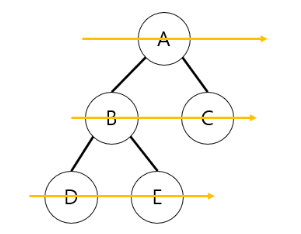
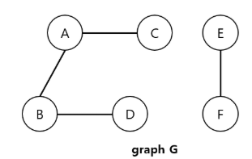
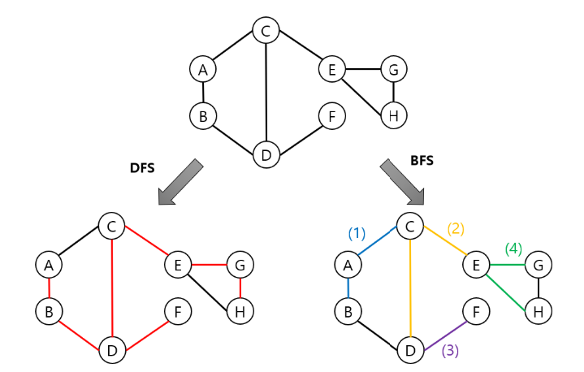
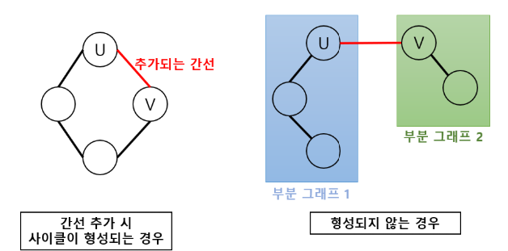
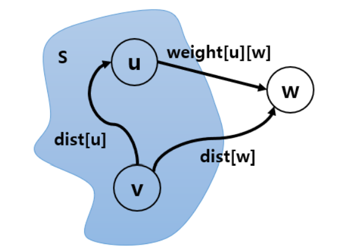
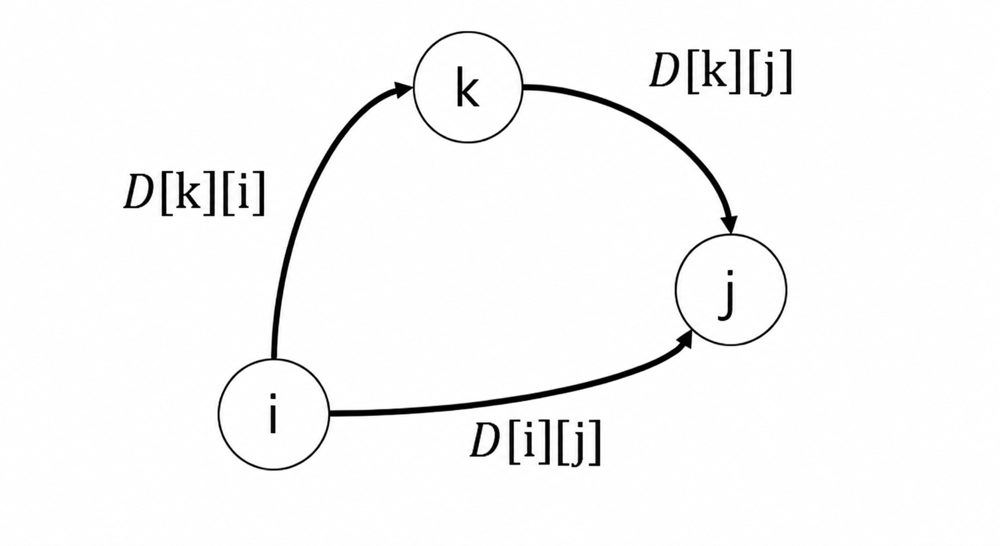

# 알고리즘 - 그래프

> [📚 전체 목차로 돌아가기](../../README.md)

## Table of Contents

- [그래프의 탐색](#1-그래프의-탐색)
- [연결 성분 (Connected Components)](#2-연결-성분-connected-components)
- [신장 트리 (Spanning Tree)](#3-신장-트리-spanning-tree)
- [Union - Find](#4-union---find)
- [최소 신장 트리 (Minimum Spanning Tree, MST)](#5-최소-신장-트리-minimum-spanning-tree-mst)
- [최단 경로(Shortest Path) 알고리즘](#6-최단-경로shortest-path-알고리즘)
- [위상 정렬 (Topological Sort)](#7-위상-정렬-topological-sort)

---

## #1. 그래프의 탐색
그래프 탐색은 시작 정점부터 시작하여 차례대로 모든 정점들을 한 번씩 방문하는 연산이다. 기본적인 탐색 방법으로 깊이 우선 탐색과 너비 우선 탐색이 있다.

---
### #1.1 깊이 우선 탐색 (Depth First Search, DFS)

DFS는 **시작 정점에서 하나의 분기를 따라 가능한 한 깊이 탐색한 뒤, 더 이상 진행할 수 없으면 가장 최근의 분기점으로 되돌아가 다른 분기를 다시 깊이 탐색하는 알고리즘**이다. 
- 그래서 재귀적인 형태로 구현하는 것이 적합하다. 스택을 통해서 구현할 수도 있다. 

일반적인 그래프에서는 이미 방문한 정점을 다시 탐색하지 않도록 방문 여부를 기록한다.

```python
# 그래프 초기화
n = 6

# 인접 리스트로 표현한 그래프
graph = [
    [],         # 0번 정점은 사용하지 않음
    [2, 3],     # 1번 정점의 인접 정점
    [1, 4, 5],  # 2
    [1, 6],     # 3
    [2],        # 4
    [2],        # 5
    [3]         # 6
]

# 방문 여부 초기화
visited = [False] * (n + 1)

dfs_path = []


def dfs(graph, vertex, visited, path):
    # 현재 정점을 방문 처리
    visited[vertex] = True
    path.append(vertex)

    # 현재 정점과 연결된 인접 정점 확인
    for neighbor in graph[vertex]:
        # 아직 방문하지 않은 정점이라면 깊이 우선 탐색
        if not visited[neighbor]:

            dfs(graph, neighbor, visited, path)


dfs(graph, 1, visited, dfs_path)
print("DFS :", " → ".join(map(str, dfs_path)))
```

**DFS 장단점 및 시간복잡도**

`장점`
- 현재 탐색 중인 경로 상의 정점(노드)들만 유지하면 되므로, BFS에 비해 저장 공간 소비(즉, 메모리 사용)가 비교적 적다.
- **깊은 위치의 해를 찾는 문제에 적합**하다. 한 경로를 끝까지 깊게 탐색하므로, target이 깊은 곳에 있을 때 유리하다. 

`단점`
- **최단 경로를 보장하지 않는다.** 먼저 선택한 경로를 깊게 탐색하기 때문에 더 짧은 경로가 다른 분기에 있어도 긴 경로를 먼저 찾을 수 있다. 
    - 그러므로, 최단 경로를 구하기 위해서는 모든 경로를 전부 확인해야 한다. 
- 매우 깊은 경로를 오래 탐색할 수 있다. 탐색 공간이 무한히 깊거나 종료 조건이 적절하지 않으면 원하는 해를 찾지 못하고 한쪽 방향으로 계속 탐색할 수도 있다.
- 사이클이 있는 그래프에서 방문 처리를 관리하지 않으면 같은 정점을 반복 방문하며 무한 루프가 발생할 수 있다. 

`시간복잡도`
- DFS와 BFS의 시간복잡도는 **그래프의 표현 방식에 따라 달라진다.**
- 노드 개수를 $n$, 간선의 개수를 $e$라고 하자. 
- DFS는 탐색과 다시 되돌아 가는 과정에서 그래프의 모든 edge를 조사한다. 그러므로, 
- 인접 리스트로 표현한 그래프를 사용할 경우, DFS 탐색 연산의 시간복잡도는 $O(n+e)$
    - 인접 리스트에서는 각 노드에 대해 연결된 인접 노드들만 저장한다. 그러므로 DFS가 모든 노드를 한 번씩 방문하는 데 $O(n)$, 각 노드의 인접 리스트에 저장된 간선 정보를 모두 확인하는 데 총 $O(e)$가 필요하다. 그래서 총 시간복잡도는 $O(n+e)$
- 인접 행렬로 표현한 그래프를 사용할 경우, $O(n^2)$이다. 
    - 인접 행렬은 $n$개의 노드에 대해 $n \times n$ 크기를 사용함. 그래서 한 노드의 인접한 노드를 찾기 위해, 행의 $n$개 원소를 모두 확인해야 한다. $n$개의 정점 $\times$ $n$개 검사가 되어 $O(n^2)

---

### #1.2 너비 우선 탐색 (Breadth First Search, BFS)

BFS는 **시작 정점에서부터 인접한 모든 정점을 탐색한 후, 그 다음 레벨의 정점들을 차례대로 탐색**하는 방법이다. 

아래 예시와 같이 깊이가 아닌 너비를 우선하여 탐색하기 때문에, 먼저 시작 정점으로부터 가까운 정점들을 모두 탐색한 뒤, 그 다음 레벨의 정점들을 차례대로 탐색한다.

이 레벨(거리)가 $d#라고 하면, BFS는 거리가 $d$인 정점들을 모두 방문한 다음, $d+1$ 거리에 있는 정점들을 탐색한다.

<p align="center">
  
</p>


이렇게 BFS는 정점들을 발견한 순서대로 저장하고, 그 순서대로 처리하기 때문에 선입선출 특성을 가진 큐(Queue)를 사용한다. 큐는 먼저 들어온 순서대로 나가는 구조이므로, 발견한 정점을 먼저 방문하는 BFS에 적합한 자료구조이다. 

```python
from collections import deque

n = 6

graph = [
    [],         # 0번 정점은 사용하지 않음
    [2, 3],     # 1과 연결: 2, 3
    [1, 4, 5],  # 2와 연결: 1, 4, 5
    [1, 6],     # 3과 연결: 1, 6
    [2],        # 4와 연결: 2
    [2],        # 5와 연결: 2
    [3]         # 6과 연결: 3
]

visited = [False] * (n + 1)


def bfs(graph, start, visited):
    # 시작 정점을 큐에 넣고 방문 처리
    queue = deque([start])
    visited[start] = True
    path = []

    while queue:
        vertex = queue.popleft() # 큐의 맨 앞 정점을 꺼내서 현재 처리할 정점으로 선택 
        path.append(vertex)

        # 현재 정점과 연결된 모든 인접 정점 확인
        for neighbor in graph[vertex]:
            # 아직 방문하지 않은 정점을
            if not visited[neighbor]:
                # 방문 처리한 뒤
                visited[neighbor] = True
                # 큐에 넣는다.
                queue.append(neighbor)
    return path

bfs_path = bfs(graph, 1, visited)
print("BFS :", " → ".join(map(str, bfs_path)))
```

**BFS 장단점 및 시간복잡도**

`장점`
- 특성상 노드의 수가 적고 깊이가 얕은 경우 빠르게 동작한다.
- 그리고 레벨 단위 탐색에 적합하다. 예를 들어 "시작점에서 몇 단계 떨어져 있는가", "최소 몇 번 이동해야 하는가" 같은 문제에 적합하다. 
- 가중치가 없는 그래프에서 최단 경로를 보장한다. 
    -  노드를 거리 순서대로 방문하므로 여러 경로가 존재하더라도 간선 수가 가장 적은 최단 경로를 보장한다. 
    - 그래서 최단 경로가 존재한다면, 다른 경로가 무한히 깊어져도 최단 경로를 반드시 찾을 수 있다. 

`단점`
- 그래프의 너비가 넓으면 한꺼번에 많은 노드를 큐에 저장하므로, 이 경우에는 메모리 사용량이 클 수 있다. 
- 또한, 깊은 곳에 있는 target을 찾을 때 비효율적일 수 있다.
- 가중치가 서로 다른 그래프에서는 최소 비용 경로를 보장하지 않는다. 
    - BFS가 보장하는 것은 최소 간선 수이지 최소 가중치 합이 아니다. 

`시간복잡도`
- BFS도 그래프가 인접 리스트로 표현되어 있으면 $O(n+e)$, 인접 행렬로 표현되어 있으면 $O(n^2)$ 시간만큼 탐색을 수행한다. 

---

## #2. 연결 성분 (Connected Components) 

연결 성분이란 **무방향 그래프에서 서로 경로로 연결되어 있는 정점들의 최대 집합** 또는 동치로 최대로 연결된 부분 그래프(subgraph)를 의미한다.

연결 성분을 찾기 위해 DFS나 BFS를 사용할 수 있다. 임의의 정점에서 DFS/BFS를 적용해 연결되어 있는 모든 정점들을 방문하는 것이다. 단, 그래프의 형태가 connected graph가 아니면 한 번의 탐색으로 모든 정점들을 방문할 수 없으므로 DFS/BFS를 반복적으로 수행해야 한다. 
- 다른 관점으로 보면, DFS/BFS 반복 횟수는 그래프 안에 있는 connected graph의 개수이다.

아래 예시는 G라는 그래프가 2개의 connected graph로 구성된 경우이다. 

<p align="center">
  
</p>

G는 두 개의 subgraph로 구성되므로 한 번의 탐색만으로는 모든 정점들을 방문할 수 없다. DFS나 BFS를 2번 실행해야 한다.
```python
## DFS
def find_connected_components_dfs(graph):
    # 그래프 전체에서 이미 방문한 정점을 저장
    visited = set()

    # 발견한 모든 연결 성분을 저장
    # 예: [[1, 2, 3], [4, 5], [6]]
    components = []

    # 그래프의 모든 정점을 하나씩 확인
    for vertex in graph:

        # 아직 방문하지 않은 정점이라면
        # 새로운 연결 성분의 시작점이라는 의미
        if vertex not in visited:

            # vertex에서 DFS를 시작하여
            # vertex와 연결된 모든 정점을 하나의 연결 성분으로 수집
            component = []
            collect_component_dfs(
                graph,
                vertex,
                visited,
                component
            )

            # 완성된 하나의 연결 성분을 저장
            components.append(component)

    return components


def collect_component_dfs(graph, vertex, visited, component):
    # 현재 정점을 방문 처리
    visited.add(vertex)

    # 현재 정점을 현재 연결 성분에 추가
    component.append(vertex)

    # 현재 정점과 연결된 모든 인접 정점을 확인
    for neighbor in graph[vertex]:

        # 아직 방문하지 않은 정점이라면
        # 해당 정점으로 더 깊게 탐색
        if neighbor not in visited:
            collect_component_dfs(
                graph,
                neighbor,
                visited,
                component
            )


## BFS
from collections import deque


def find_connected_components_bfs(graph):
    # 그래프 전체에서 이미 방문한 정점을 저장
    visited = set()

    # 발견한 모든 연결 성분을 저장
    components = []

    # 그래프의 모든 정점을 하나씩 확인
    for vertex in graph:

        # 아직 방문하지 않은 정점이라면
        # 새로운 연결 성분의 시작점
        if vertex not in visited:

            # vertex에서 BFS를 시작하여
            # 하나의 연결 성분을 수집
            component = collect_component_bfs(
                graph,
                vertex,
                visited
            )

            # 발견한 연결 성분을 저장
            components.append(component)

    return components


def collect_component_bfs(graph, start, visited):
    # BFS 탐색에 사용할 큐
    queue = deque([start])

    # 시작 정점을 방문 처리
    visited.add(start)

    # 현재 연결 성분에 속한 정점들을 저장
    component = [start]

    # 큐에 탐색할 정점이 남아 있는 동안 반복
    while queue:

        # 가장 먼저 큐에 들어온 정점을 꺼냄
        vertex = queue.popleft()

        # 현재 정점과 연결된 모든 인접 정점을 확인
        for neighbor in graph[vertex]:

            # 아직 방문하지 않은 정점이라면
            if neighbor not in visited:

                # 큐에 중복 삽입되지 않도록
                # 큐에 넣기 전에 방문 처리
                visited.add(neighbor)

                # 현재 연결 성분에 추가
                component.append(neighbor)

                # 이후 탐색하기 위해 큐에 추가
                queue.append(neighbor)

    # 시작 정점과 연결된 모든 정점 반환
    return component

components = find_connected_components_dfs(graph)
# components = find_connected_components_bfs(graph)
```

---

## #3. 신장 트리 (Spanning Tree)

신장 트리란 **그래프 내의 모든 정점을 포함하는 트리**를 말한다. 
- 이때 신장 트리는 "트리"이기 때문에 **사이클이 없어야 하고** 
- **모든 정점들이 연결되어 있어야 한다.** 정점의 개수가 $n$개라면, 모든 정점들을 연결하기 위해선 $n-1$개의 간선으로 연결되어 있어야 한다.

신장 트리는 사이클 없이 연결 그래프의 모든 정점을 포함하는 부분 그래프이다. 하나의 연결 그래프에는 여러 개의 신장 트리가 존재할 수 있으며, DFS나 BFS를 수행하면서 새로운 정점을 처음 방문할 때 사용한 간선들을 선택하면 신장 트리를 만들 수 있다.

아래는 DFS와 BFS를 이용해서 신장 트리를 찾는 예시이다.

<p align="center">
  
</p>

---

### #3.1 신장 트리 (Spanning Tree)
```python
from collections import deque


def bfs_spanning_tree(graph, start):
    # 시작 정점은 처음부터 방문한 것으로 처리
    visited = {start}

    # BFS 탐색에 사용할 큐
    # 시작 정점을 가장 먼저 큐에 넣는다.
    queue = deque([start])

    # 신장 트리에 포함되는 간선들을 저장할 리스트
    tree_edges = []

    #  # 큐에 탐색할 정점이 남아 있는 동안 반복
    while queue:
        # 큐에서 가장 먼저 들어온 정점을 꺼낸다.
        vertex = queue.popleft()

        # 현재 정점과 연결된 모든 인접 정점을 확인
        for neighbor in graph[vertex]:
            # 아직 방문하지 않은 정점만 탐색
            if neighbor not in visited:
                # 해당 정점을 방문 처리
                visited.add(neighbor)
                # 이후 해당 정점의 인접 정점을 탐색하기 위해 큐의 뒤쪽에 추가
                queue.append(neighbor)

                tree_edges.append((vertex, neighbor))
    return tree_edges


graph = {
    'A':{'B','C'},
    'B':{'A','D'},
    'C':{'A','D','E'},
    'D':{'B','C','F'},
    'E':{'C','G','H'},
    'F':{'D'},
    'G':{'E','H'},
    'H':{'E','G'}
}

result = bfs_spanning_tree(graph, 'A')
```

---

## #4. Union - Find
Union-Find는 **서로소 집합을 표현하는 자료구조로, 각 집합의 대표 원소를 통해 집합들을 구분한다.**

Union-Find에는 **합집합(Union)과 찾기(Find) 연산**이 있다. 
- 합집합 연산 `union(x, y)`는 `x`가 속한 집합과 `y`가 속한 집합을 하나의 집합으로 합치는 연산이다. 
- `x`와 `y`가 속한 두 집합의 대표 원소를 찾은 뒤, 한 대표 원소를 다른 대표 원소의 부모로 연결하여 두 집합을 하나로 합치는 연산이다.
- `find(x)`는 여러 서로소 집합 중 원소 `x`가 속한 집합의 대표 원소(root)를 반환하는 연산이다. 이를 통해 `x`가 어느 집합에 속하는지 식별할 수 있다.

Union-Find 자료구조를 이용해 무방향 그래프 내에서의 사이클을 판별할 수 있다. 

---

## #5. 최소 신장 트리 (Minimum Spanning Tree, MST)

MST는 **신장 트리 중 사용된 간선들의 가중치 합(비용)이 최소인 트리**를 말한다. 무방향 가중치 그래프에서 가중치 합이 최소가 되도록 연결할 수 있는 방법을 찾을 때 사용한다. 

MST를 구하는 방법으로 Kruskal과 Prim의 알고리즘이 있다.
- 일반적으로 그래프 내에 적은 수의 간선을 가지는 희소 그래프(sparse graph)는 Kruskal이 적합하고,
- 그래프 내에 많은 간선이 존재하는 밀집 그래프(dense graph)는 Prim이 적합하다. 
- 다만 실제 성능은 그래프 표현 방식과 자료구조에 따라 달라질 수 있다.

### #5.1 Kruskal

사이클이 존재할 경우, 두 정점 사이에 두 개의 경로가 생기므로 비용이 비효율적이게 된다. 사이클 없이 모든 정점 $n$개를 연결하기 위해 $n-1$개의 간선만을 사용해야 한다.

그리고 greedy method로 찾은 해는 항상 최적의 해라는 보장이 없기 때문에, 최적의 솔루션인지 반드시 검증이 필요하다. Kruskal MST 알고리즘은 greedy method를 이용해 솔루션을 구했을 때, 그 해답이 최적의 해답임이 증명되어 있다.

Kruskal은 **탐욕적(greedy) 탐색 방법을 이용하여, 각 단계에서 사이클을 형성하지 않는 최소 비용 간선을 선택**한다. 이러한 선택 과정을 반복해서 그래프의 모든 정점을 최소 비용으로 연결하는 최적해를 도출한다. 

Kruskal은 이렇게 **간점 선택**을 기반으로 한다.
- Prim은 **정점 선택**을 기반으로 하는 알고리즘이다. 

선택 과정은 다음과 같다.
- (1) 모든 간선의 가중치 값을 오름차순 정렬한다.
- (2) 가장 가중치가 작은 간선 $e$를 선택한다.
- (3) (2)에서 선택한 $e$를 신장 트리에 넣었을 때 사이클이 발생하면, 해당 간선을 신장 트리에 넣지 않고 다시 (2)로 이동한다.
- 사이클이 생기지 않으면 최소 신장 트리(MST)에 삽입한다.
- (4) $n-1$개의 간선이 삽입될 때까지 (2)로 이동한다.

참고로, 새로운 간선을 추가했을 때 사이클 형성 여부는 다음 그림에서처럼 새로 추가된 간선의 양 끝 정점이 같은 집합(= 부분 그래프)에 속하는지에 따라 달라진다.

<p align="center">
  
</p>

그러므로, 새로 추가할 간선 (u, v)의 양 끝 정점 u와 v가 같은 집합에 속하는지(즉, 사이클이 발생하는지) 확인해야 하며, 이를 위해 **Union-Find**를 사용한다.

---

### #5.2 Prim
Prim은 **하나의 정점에서부터 시작하여 트리를 단계적으로 확장**하는 방법이다. **정점 선택**을 기반으로 한다.

Prim 알고리즘의 동작 방법은 다음과 같다.
- (1) 초기에 시작 정점만 신장 트리에 포함시킨다. 
- (2) 현재까지 만들어진 트리의 정점들과 인접한 정점들 중 가중치 값이 가장 작은 간선으로 연결된 정점을 선택하여 신장 트리를 확장한다.
- (3) 이 과정을 $n-1$ 개의 간선을 트리에 추가할 때까지 반복한다. 

---
## #6. 최단 경로(Shortest Path) 알고리즘

최단 경로는 **가중치 그래프에서 두 정점을 연결하는 경로들 중, 간선들의 가중치 합이 최소가 되는 경로**이다.

대표적인 알고리즘으로 Dijkstra, Floyd-Warshall, Bellman-Ford 가 있다.

### #6.1 Dijkstra

다익스트라 알고리즘은 **하나의 시작 정점에서 다른 모든 정점까지의 최단 경로를 구하는 알고리즘**으로, 그리디 알고리즘을 사용한다. 그래프의 모든 간선 가중치는 0 이상이어야 한다.

Dijkstra 알고리즘의 동작 방식은 다음과 같다.
- 최단 거리를 기록할 최단 거리 테이블 `dist`와 노드 방문 여부를 확인할 `visited` 테이블을 사용한다.
- (1) `dist`와 `visited`를 초기화한다. 
- 먼저 시작 정점 `start`를 방문(`visited[start] = True`)한다. 초기에 `dist`에 추가된 시작 정점 `start`까지의 거리는 `0`이다. 
    - `dist[v]`는 시작 정점에서 정점 `v`까지, 현재까지 발견한 가장 짧은 거리이다. 
    - 초기에 `dist[start]`는 자기 자신과의 거리이므로 0이다. 
- `v`와 나머지 정점까지의 거리는 아직 알 수 없으므로 `INF`로 초기화한다. 
- (2) 시작 정점 `v`에서 갈 수 있는 다른 정점들까지의 거리를 `dist`에 기록한다. 
- (3) 미방문 정점 중 `dist` 값이 가장 작은 정점 `u`를 방문(`visited`에 기록)한다. 이때의 `dist[u]`는 시작 정점에서 `u`까지의 최단 거리이다. 
- (4) 방문한 정점 `u`와 연결된 미방문 인접 정점들의 거리를 확인한다. 
- `visited=True`인 정점들의 집합을 `S`라고 하자. 현재는 `v`와 `u`가 `S`에 포함된 상태이다. 
- 아직 `S`에 포함되지 않은 인접 정점 `w`에 대해, 시작 정점 `v`에서 `w`까지의 거리 `dist[w]`와 (3)에서 확인한 `dist[u]`를 거쳐 `w`까지 가는 거리 `dist[u] + weight[u][w]`를 비교한다. 비교 결과 더 작은 거리로 최단 거리 테이블 `dist`를 갱신한다. 즉, `dist[w] = min(dist[w], dist[u] + weight[u][w])`
- (5) 시작 정점에서 도달 가능한 모든 정점의 최단 거리가 확정될 때까지 (3)~(4)를 반복한다. 

<p align="center">
  
</p>


시간복잡도 

---

### #6.2 Floyd-Warshall
플로이드–워셜은 간단히 말하면, **모든 정점 사이의 최단 경로를 구하는 알고리즘**이다. 

$i$는 출발 정점, $j$는 도착 정점, $k$는 이번 단계에서 새롭게 경유지로 고려하는 정점이라고 하자. Floyd의 핵심 아이디어는 사용할 수 있는 경우 정점을 하나씩 추가하면서 모든 $i \rightarrow j$ 최단거리를 갱신하는 것이다.

최단 거리 테이블 `dist`를 $D$라고 하자. 인접 행렬로 구현하면, $i=j$일 때 $D[i][j] = 0$, $i \rightarrow j$ 간선이 존재하면 $D[i][j] = w(i, j)$, 존재하지 않으면 갈 수 없는 경로이므로 $D[i][j] = ∞$이다. 

정점 $k$를 경유지로 고려할 때 $i$에서 $j$로 가는 최단경로에는 두 가지 가능성이 있다.
- (1) 정점 $k$를 경유하지 않는 경우: 기존에 알고 있던 $i \rightarrow j$ 최단 거리를 그대로 사용한다.
- (2) 정점 $k$를 경유하는 경우: 경로는 $i \rightarrow k \rightarrow j$가 된다. 

플로이드–워셜 알고리즘의 핵심은 (1)과 (2) 중 더 짧은 값을 선택한다: $$D[i][j] = \text{min} (D[i][j], \; D[i][k] + D[k][j])$$

<p align="center">
  
</p>


플로이드–워셜 알고리즘은 "사용할 수 있는 경유 정점의 범위"를 단계적으로 늘려 가며 이전 단계에서 구한 최단거리 결과를 이용해 다음 단계의 최단거리를 계산하는 동적 계획법(DP) 알고리즘이다.

```python
for k <- 0 to n-1:
    for i <- 0 to n-1:
        for j <- 0 to n-1:
            D[i][j] = min(D[i][j], D[i][k] + D[k][j])
```
- $k$는 이번 단계에서 경유지로 고려할 정점
- $i$는 출발 정점, $j$는 도착 정점이다. 
- $k$에 대한 루프가 맨 위에 있으므로, $k$ 하나에 대해 모든 $(i, j)$ 쌍을 검사하면서, (1) 경유지를 고려하지 않는 최단 거리 $D[i][j]$와 (2) $k$를 경유했을 때의 거리 $D[i][k] + D[k][j]$를 비교한다. 
- 그러므로 전체 시간복잡도는 $O(V^3)$가 된다. 

```python
import math

INF = math.inf
vertex = ['A', 'B', 'C', 'D']
edges = [
    (0, 1, 3),
    (0, 3, 7),
    (1, 2, 1),
    (1, 3, 5),
    (2, 3, 2)
]

n = len(vertex) # 정점 수
# 그래프 초기화
graph = [[INF] * n for _ in range(n)]

# 자기 자신과의 거리(비용) 초기화
# 자기 자신과의 거리는 0
for i in range(n):
    graph[i][i] = 0


# 간선 정보 저장
for a, b, c in edges:
    graph[a][b] = c
    graph[b][a] = c   


# 플로이드 워셜 알고리즘 수행
for k in range(n):
    for i in range(n):
        for j in range(n):
            graph[i][j] = min(graph[i][j], graph[i][k] + graph[k][j])
            

# 결과 출력
for i in range(n):
    for j in range(n):
        if graph[i][j] == INF:
            print("INF", end=" ")
        else:
            print(graph[i][j], end=" ")
    print()
```


---

### #6.3 Bellman-Ford

벨만 포드는 하나의 시작 정점에서 다른 모든 정점까지의 최단 거리를 구하는 알고리즘이다. 다익스트라와 비슷한 목적을 가지지만, **음수 가중치 간선이 있어도 사용할 수 있고 음수 사이클가지 탐지할 수 있다**는 차이점이 있다. 

```python
import math

INF = math.inf

vertex = ['A', 'B', 'C', 'D']

edges = [
    (0, 1, 3),
    (0, 3, 7),
    (1, 2, 1),
    (1, 3, 5),
    (2, 3, 2)
]

n = len(vertex)

def bellman_ford(start):
    dist = [INF] * n
    dist[start] = 0

    # n-1번 반복
    for _ in range(n - 1):
        for u, v, cost in edges:
            if dist[u] != INF:
                dist[v] = min(
                    dist[v],
                    dist[u] + cost
                )

    # 음수 사이클 검사
    for u, v, cost in edges:
        if dist[u] != INF and dist[v] > dist[u] + cost:
            return None

    return dist
```
벨만 포드와 다익스트라는 동일한 초기화(`dist = [INF] * n`, `dist[start] = 0`)와 `dist[v] = min(dist[v], dist[u] + w(u, v))` 연산을 사용한다. 둘 다 "현재 알고 있는 `v`까지의 거리보다 `u`를 거쳐서 `v`로 가는 것이 더 짧은지" 검사하기 때문이다. 

차이점은 간선을 검사하는 방식이다. 벨만은 모든 간선을 전부 검사한다. 그리고 이를 모든 정점 개수만큼 반복한다. 어떤 간선이 최단경로에 포함될지 미리 알 수 없고, 음수 간선 때문에 특정 정점의 최단거리를 중간에 확정할 수도 없으므로 모든 간선을 반복해서 검사한다.

반면 Dijkstra는 현재 최단거리가 가장 작은 정점을 선택한 뒤, 그 정점에서 나가는 간선들을 중심으로 `dist[v] = min(dist[v], dist[u] + w(u, v))`를 수행한다. 

음수 사이클이 없다면 정점이 $V$개인 그래프에서 최단 경로는 최대 $V-1$개의 간선만 필요하다. 즉, 모든 간선 $V-1$번 탐색한 뒤에는 음수 사이클이 없다면 더 이상 거리가 줄어들 수 없어야 한다. 

그런데 이후 모든 간선을 한 번 더 검사했을 때 `dist[v] > dist[u] + w(u, v)`가 성립한다면, `dist[v]`를 더 작게 만들 수 있다. 이는 시작 정점에서 도달 가능한 음수 사이클이 존재함을 뜻한다. 


벨만 포드는 모든 간선을 모든 정점 개수만큼 반복하기 때문에 시간복잡도가 $O(VE)$이다. 그래프가 매우 조밀해서 $E \sim V^2$이라면 $O(VE) = O(V^3)$까지 커질 수 있다. 

---

## #7. 위상 정렬 (Topological Sort)
위상 정렬은 **선행 순서(즉, 선후 관계)에 맞게 방향 비순환 그래프의 모든 정점을 나열하는 방법**이다.
- 그래프에 사이클이 존재하면 이러한 선후 관계를 만족하는 순서를 만들 수 없으므로 위상 정렬이 불가능하다.

방향 그래프의 위상 알고리즘은 **진입 차수**를 사용한다. 여기서 진입 차수란 노드의 관점에서 들어오는 간선의 개수를 말한다.

알고리즘은 다음과 같다.
- 먼저, 진입 차수가 0인 선행 정점이 없는 정점을 하나 선택하고, 선택된 정점과 연결된 간선을 모두 제거한다. 이는 해당 정점이 수행되었음을 의미한다.
- 간선이 삭제되면, 삭제된 간선과 연결된 정점들의 진입 차수가 변경된다.
- 이 과정을 반복하면 선후 관계에 맞게 모든 정점들이 삭제된다. 
- **정점들이 삭제되는 순서가 위상 순서**가 되는 것이다.
- 만약, 삭제를 진행하는 과정에서 그래프에 남아 있는 정점들 중 진입 차수가 0인 정점이 하나도 없다면, 이는 그래프에 사이클이 존재하기 때문이다. 그래서 사이클이 존재하는 그래프는 위상 정렬이 불가능하다. 

아래는 인접 그래프로 표현된 그래프에 위상 정렬을 적용하는 구현 예시이다.
```python
from collections import deque


def topological_sort(graph, in_degree):
    # 진입 차수가 0인 정점을 저장할 큐
    queue = deque()

    # 위상 정렬 결과
    result = []

    # 처음부터 진입 차수가 0인 모든 정점을 큐에 추가
    for vertex in range(len(graph)):
        if in_degree[vertex] == 0:
            queue.append(vertex)

    # 진입 차수가 0인 정점들을 차례대로 처리
    while queue:
        # 현재 진입 차수가 0인 정점을 꺼냄
        vertex = queue.popleft()

        # 위상 정렬 결과에 현재 정점 추가
        result.append(vertex)

        # 현재 정점에서 나가는 모든 간선을 확인
        for neighbor in graph[vertex]:
            # neighbor의 진입 차수를 1 감소 = 간선 제거 
            in_degree[neighbor] -= 1

            # 간선 제거 후 진입 차수가 0이 되었다면
            if in_degree[neighbor] == 0:
                queue.append(neighbor)

    # 모든 정점을 처리하지 못했다면 사이클이 존재
    if len(result) != len(graph):
        return None

    return result

graph = [
    [2],    # 정점 0 → 정점 2
    [2],    # 정점 1 → 정점 2
    [3],    # 정점 2 → 정점 3
    []      # 정점 3
]

# 정점 i로 들어오는 간선의 개수
in_degree = [
    0,  
    0,  
    2,  
    1   
]

result = topological_sort(graph, in_degree)
```
---
