# 자료구조

> [📚 전체 목차로 돌아가기](../../README.md)

## Table of Contents

- [배열 (Array)](#1-배열-array)
- [연결 리스트 (Linked List)](#2-연결-리스트-linked-list)
- [맵 (Map)](#3-맵-map)
- [해시 테이블 (Hash Table)](#4-해시-테이블-hash-table)
- [스택 (Stack)](#5-스택-stack)
- [큐 (Queue)](#6-큐-queue)
- [덱 (Deque)](#7-덱-deque)
- [트리 (Tree)](#8-트리-tree)
- [이진 트리 (Binary Tree)](#9-이진-트리-binary-tree)
- [이진 탐색 트리 (Binary Search Tree)](#10-이진-탐색-트리-binary-search-tree)
- [균형 이진 탐색 트리와 AVL 트리](#11-균형-이진-탐색-트리와-avl-트리)
- [힙 (Heap)](#12-힙-heap)
- [그래프 (Graph)](#13-그래프-graph)
- [전체 시간복잡도 요약](#전체-시간복잡도-요약)

---

## #1. 배열 (Array)
데이터들을 **메모리 상에 연속된 공간으로 일렬로 나열하여 저장**하는 가장 기초적인 선형 자료구조이다.

각 데이터는 요소(element)라고 부르며, 고유한 번호인 인덱스(index)를 이용해 특정 element에 빠르게 접근할 수 있다. 

### #1.1 배열의 삽입, 삭제 ,탐색
배열의 길이가 $N$이라고 하자.

배열의 가장 큰 장점은 index를 통한 특정 item에 대한 접근의 시간복잡도가 $O(1)$이라는 것이다. 

삽입은 최악의 경우 시간복잡도가 $O(N)$이다. 새로운 값이 삽입될 자리를 확보하기 위해 뒤쪽 값들이 한 칸씩 이동해야 하기 때문이다. 맨 앞에 삽입하면 $N$개 전부가 밀려야 하므로 이때가 최악이다.

배열의 맨 뒤에만 값을 삽입한다면, 이 경우에는 삽입 시 다른 값들의 이동이 전혀 발생하지 않기 때문에 시간복잡도는 $O(1)$이다. 

삭제도 맨 뒤의 값만 제거하면 $O(1)$이다. 최악의 경우는 맨 앞의 값을 삭제하는 것으로, 나머지 $N-1$개의 값들이 모두 앞으로 이동해야 하기 때문에 시간복잡도는 $O(N)$이다.

탐색의 최악의 경우는 찾고자 하는 값이 배열의 맨 끝에 있거나 아예 존재하지 않는 경우로 시간복잡도는 $O(N)$이다.

| 연산 | 시간복잡도 |
|:---:|:---:|:---|
| `index 접근` | $O(1)$ |
| `(선형) 탐색` | $O(N)$ | 
| `삽입 (맨 뒤)` | $O(1)$ | 
| `삽입 (임의 위치)` | $O(N)$ | 
| `삭제 (맨 뒤)` | $O(1)$ | |
| `삭제 (임의 위치)` | $O(N)$ | 

### #1.2 정적 배열 vs. 동적 배열
**정적 배열**은 배열 선언과 동시에 크기를 정해줘야 하며, 한번 선언된 이후에는 크기를 바꿀 수 없다. 그렇다고 해서 필요 이상의 크기로 배열을 선언하면, 사용하지 않는 공간까지 확보되므로 메모리가 낭비될 수 있다.
- Java의 일반 배열(예: `int[] arr = new int[10]`)이 대표적인 정적 배열이다. 한 번 배열을 선언하면 길이가 변하지 않는다.

**동적 배열**은 정적 배열과 달리 실행 중에 필요한 만큼 크기를 조절할 수 있다. 배열에 새로운 데이터를 추가할 공간이 부족해지면 더 큰 크기의 배열을 새로 생성하고, 기존 배열에 있던 데이터를 새로운 배열로 복사하여 저장 공간을 확장한다. 그러므로 처음부터 필요한 데이터의 개수를 정확히 알지 못하더라도 유연하게 사용할 수 있다는 장점이 있다.
- Python의 `list`는 동적 배열로 구현되어 있다.

cf) **size와 capacity**

동적 배열을 이해하려면 두 값을 구분해야 한다.

- **size**: 현재 실제로 저장된 데이터의 개수
- **capacity**: 현재 확보해 둔 메모리 공간의 크기

항상 `size ≤ capacity`이며, 그 차이만큼은 아직 쓰이지 않은 여유 공간이다.

```
capacity = 8
┌───┬───┬───┬───┬───┬───┬───┬───┐
│ 1 │ 2 │ 3 │ 4 │ 5 │   │   │   │
└───┴───┴───┴───┴───┴───┴───┴───┘
  └────── size = 5 ──────┘
```

**확장(resizing) 과정**

size가 capacity에 도달하면(즉, 남은 공간이 없는 상태) 새로운 item을 추가하기 위해 다음 과정을 거친다.

1. 기존보다 더 큰 새로운 메모리 공간을 할당한다.
2. 기존 배열의 모든 데이터를 새 공간으로 복사한다.
3. 기존 메모리 공간을 해제한다.
4. 새 item을 추가한다.

이때 확장 크기는 보통 **기존 capacity의 상수 배**로 늘린다.

---

## #2. 연결 리스트 (Linked List)

linked list는 **메모리상에 서로 떨어져 있는 데이터의 메모리 주소를 참조함으로써 순서대로 이어진 것처럼 사용할 수 있는 자료구조**이다.

각각의 데이터들이 다음 데이터(즉, 다음 순서)를 기억하는 형태이기 때문에, 배열처럼 데이터들이 연속된 메모리 공간에 있을 필요가 없다.

예를 들어 실제 메모리 주소가 다음과 같이 떨어져 있다고 생각해보자.

```
주소 100        주소 820        주소 350
┌──────────┐    ┌──────────┐    ┌──────────┐
│ 데이터 A │    │ 데이터 B │    │ 데이터 C │
│ 링크 820 │ →  │ 링크 350 │ →  │ 링크 null│
└──────────┘    └──────────┘    └──────────┘
```
실제 메모리에서는 `100`, `820`, `350`으로 서로 떨어져 있어도, 각 데이터가 다음 데이터의 위치를 기억하기 때문에 논리적으로는 `데이터 A → 데이터 B → 데이터 C`라는 순서를 만들 수 있다.

### #Head와 Tail

linked list를 구성하는 각각의 원소를 `노드(node)`라고 부른다.

일반적으로 linked list의 노드는 크게 두 부분으로 구성된다: `데이터 필드(data field)`와 `링크 필드(link field)`
1. 실제로 저장하려는 값을 담고 있는 `데이터 필드`
2. 다음 노드가 어디에 있는지를 나타내는 `링크 필드` 또는 `포인터(pointer)`
   - 정확히는, 포인터가 다음 노드의 주소를 담고 있다(= 가리킨다).

```
┌─────────────┬─────────────┐
│     10      │     ●───────┼──→ 다음 Node
└─────────────┴─────────────┘
  데이터 필드      링크 필드
```

linked list의 첫 번째 노드를 **헤드(head)**라고 부른다. 프로그램은 첫 번째 노드가 메모리 어디에 있는지 알아야 하므로, 첫 번째 노드를 가리키는 헤드 포인터(head pointer)를 둔다.

```
head pointer
     │
     ↓
┌─────────┐     ┌─────────┐     ┌─────────┐
│10│   ●──┼────→│20│   ●──┼────→│30│ null │
└─────────┘     └─────────┘     └─────────┘
   head                            tail
```

linked list의 마지막 노드를 **테일(tail)**이라고 부른다. 마지막 노드의 링크는 `null`을 가리키며, 구현에 따라 마지막 노드를 가리키는 tail pointer를 함께 두기도 한다. tail pointer가 있으면 맨 뒤 삽입을 $O(1)$에 할 수 있다.

### #2.2 링크드 리스트의 삽입, 삭제, 탐색

linked list는 연속된 공간을 사용하지 않기 때문에 배열과 달리, **삽입/삭제할 위치의 노드를 정확히 알고 있다면(즉, 참조하고 있다면)** 삽입과 삭제 연산의 시간복잡도는 모두 $O(1)$이다. 링크만 바꾸면 되기 때문이다.

**삽입** — 기존 노드의 링크를 새로운 노드에 연결하고, 새로운 노드의 링크를 원래 다음 노드에 연결한다.

```
[변경 전]  [10] ──→ [30]

[변경 후]  [10] ──→ [20] ──→ [30]
```

**삭제** — 삭제할 노드의 이전 노드의 링크를 삭제할 노드의 다음 노드로 연결하여 건너뛰게 한다.

```
[변경 전]  [10] ──→ [20] ──→ [30]

[변경 후]  [10] ─────────────→ [30]   (20은 연결에서 제외됨)
```

**탐색** — 배열처럼 특정 위치에 바로 접근할 수 없기 때문에 head부터 링크를 따라 노드를 하나씩 순서대로 확인해야 한다. 그래서 최악의 경우 시간복잡도는 $O(N)$이다. 

그래서 삽입/삭제도 삽입/삭제할 위치를 모르는 상태에서 그 위치를 먼저 찾아야 한다면, 탐색 비용이 붙어 전체 시간복잡도는 $O(N)$이 된다.

또한, singly linked list의 단점 중 하나는 **단방향**이라는 것이다. 다음 노드를 가리키는 `next` 포인트만 가지고 있어 이전 노드를 가리키는 정보는 저장하지 않는다. 그러므로 이전 노드로 되돌아갈 수 없어 head부터 다시 탐색해야 한다. 
- doubly linked list는 `prev`가 있어 노드 자체만 알아도 $O(1)$ 삭제가 가능하다.

즉, linked list는 삽입·삭제 시 데이터 이동 없이 링크만 변경할 수 있지만, 원하는 노드를 찾기 위해서는 처음(`head`)부터 순차 탐색해야 한다.

### #2.3 singly linked list 

singly linked list는 head에서 tail까지 **단방향**으로 포인터가 이어진 형태이다.

단방향이기 때문에 $N$번째 노드에서 $N-1$번째 노드로 접근할 수 없다. 다시 head부터 탐색하여 $N-1$번째에 접근해야 한다.

```
head
 ↓
[10|●]──→[20|●]──→[30|null]
```

### #2.4 doubly linked list (이중 연결 리스트)

singly linked list의 단방향 문제를 해결한 것이 doubly linked list이다.

doubly linked list를 구성하는 노드는 하나의 데이터와 두 개의 링크를 가지고 있다. 두 링크 중 `next`는 다음 노드를, `prev`는 이전 노드를 가리킨다.
```
      head                                  tail
       ↓                                     ↓
null←[●|10|●]⇄[●|20|●]⇄[●|30|●]→null
      prev next
```

doubly linked list는 단순히 singly linked list에 `prev`가 추가된 것 이외엔 큰 차이가 없다. 삽입과 삭제도 링크만 바꾼다는 점에서 동일하지만, 바꿔야 할 링크가 2배(양쪽 노드의 `next`와 `prev`)라는 점이 다르다.

탐색의 경우도 doubly linked list가 양방향(next와 prev)이지만, 배열처럼 특정 위치에 즉시 접근할 수 있는 것은 아니다. singly linked list와 마찬가지로 링크를 따라 노드를 순차적으로 확인해야 한다.

그래서 삽입, 삭제, 탐색의 시간복잡도는 singly linked list와 동일하게 $O(1)$, $O(1)$, $O(N)$이다.

**singly linked list보다 유리한 점**

- 삭제할 노드 자체만 알고 있어도 `prev`를 통해 이전 노드를 바로 알 수 있으므로 $O(1)$ 삭제가 가능하다.
- head와 tail을 모두 관리한다면, 앞쪽에 가까운 노드는 head에서, 뒤쪽에 가까운 노드는 tail에서 출발할 수 있어 실제 이동 횟수를 줄일 수 있다. 
    - 그래도 최악은 여전히 $O(N)$이다. 예를 들어 가운데쯤 있는 노드를 찾는다면, head나 tail 중 어디에서 출발해도 대략 $N/2$번 이동해야 한다. 즉, 실제 이동 횟수는 줄어들지만 $O(\frac{N}{2}) = O(N)$
- 역방향 순회가 가능하다.

**단점**: 노드마다 포인터를 하나 더 저장하므로 메모리 사용량이 늘고, 삽입·삭제 시 갱신해야 할 링크가 많아 구현이 더 복잡하다.

### #2.5 circular linked list (원형 연결 리스트)

마지막 노드의 `next`가 다시 첫 번째 노드(head)를 가리키도록 연결한 linked list이다.

```
 ┌──────────────────────────────┐
 ↓                              │
[10|●]──→[20|●]──→[30|●]───────┘
 head
```

삽입과 삭제는 singly linked list와 동일하게 노드 자체를 이동하는 것이 아니라 `next` 링크를 변경한다.

탐색도 원형 구조라고 해서 원하는 노드를 바로 찾을 수 있는 것은 아니다. singly linked list와 동일하게 링크를 따라 노드를 순차적으로 확인해야 한다.

그래서 삽입, 삭제, 탐색의 시간복잡도는 singly linked list와 동일하게 $O(1)$, $O(1)$, $O(N)$이다.

**특징**

- 어느 노드에서 출발하든 전체 리스트를 순회할 수 있다.
- 순회 종료 조건이 `next == null`이 아니라 **다시 head에 도달했는지**로 바뀐다. 이 조건을 빠뜨리면 무한 루프가 된다.
- tail 포인터 하나만 관리해도 `tail.next`가 곧 head이므로, 맨 앞/맨 뒤 삽입을 모두 $O(1)$에 처리할 수 있다.

---

## #3. 맵 (Map)

맵은 **key-value 쌍의 데이터를 저장하고, key로 value를 찾는 자료형**이다. 각각의 key-value 쌍을 **엔트리(entry)** 라고 하며, 맵은 이 엔트리들의 집합으로 볼 수 있다.

엔트리는 두 개의 필드를 가진다.

- **`key`**: 엔트리를 식별하고 대응되는 value를 검색하기 위해 사용하는 값
- **`value`**: 해당 key와 연결된 실제 데이터
```python
class Entry:
    def __init__(self, key, value):
        self.key = key
        self.value = value
```

> 참고: 맵은 자료구조가 아니라 ADT다.
**추상 자료형(ADT, Abstract Data Type)** 과 **자료구조(data structure)** 를 구분할 필요가 있다.
- **ADT**: 데이터와 **연산의 명세**. "무엇을 할 수 있는가"만 정의하고 "어떻게 구현하는가"는 말하지 않는다.
- **자료구조**: 그 명세를 **실제로 구현한 것**. 메모리에 어떻게 배치하고 연산을 어떤 절차로 수행할지가 정해져 있다.

맵은 "key로 value를 넣고 빼고 찾을 수 있다"는 **규약**일 뿐이며, 이를 리스트로 구현하든 해시 테이블로 구현하든 균형 트리로 구현하든 맵의 정의는 그대로다.
- Python의 딕셔너리는 맵의 개념을 제공하는 대표적인 자료형이다.


### #3.1 맵의 구현 방법
맵을 구현하는 방법은 ① 리스트를 이용하는 방법과 ② 해싱(hashing) 구조를 이용하는 방법이 있다.

key가 정수라면 가장 단순한 방법은 **key 값 자체를 배열의 index로 쓰는 것**이다.
```python
table = [None] * 1000
table[key] = value          # 저장
value = table[key]          # 조회
```

접근이 $O(1)$로 가장 빠르지만, **key의 범위가 크거나 key가 드문드문 분포하면 메모리를 낭비하게 된다.** 

예를 들어 key가 0, 1, 2, 3, 10, 50, 500, 999999999라고 하자. key 자체를 배열의 index로 사용하려면 마지막 key를 저장하기 위해 index 999999999까지 존재하는 약 10억 칸의 배열이 필요하다.  

```
key = 0, 1, 2, 3, 10, 50, 500, 999999999  (8개)

index:  0    1    2    3  ...  10  ...  50  ... 500 ... 999999999
      [ v ][ v ][ v ][ v ]... [ v ]... [ v ]...[ v ]...[    v    ]
       └──────────── 약 10억 칸 중 8칸만 사용 ────────────┘


```
마지막 key 하나를 저장하기 위해 약 10억 칸짜리 배열이 필요하지만, 실제로 쓰이는 칸은 8개뿐이다. 배열의 대부분은 사용되지 않은 채 남게 된다.

> 이 문제를 해결하는 것이 바로 **해싱**이다. key를 그대로 index로 쓰는 대신, **넓은 key 공간을 작은 테이블 크기로 압축하는 함수**를 거치게 한다. 

**리스트를 이용한 맵 구현**
 여러 엔트리를 저장할 자료구조가 필요하다. 가장 단순한 방법 중 하나는 엔트리들을 리스트에 저장하는 것이다. 아래는 리스트로 엔트리를 저장하면서, 탐색 알고리즘으로 순차 탐색을 사용하는 맵 구현 예시이다. 
 ```python
class SequentialMap:
    def __init__(self):
        self.table = []

    def size(self):
        return len(self.table)

    def search(self, key):
        index = sequential_search(self.table, key, 0, self.size() - 1)
        
        if index is None:
            return None
        else:
            return self.table[index]

    def insert(self, key, value):
        for entry in self.table:
            if entry.key == key: # 중복 key 확인 → O(n)
                entry.value = value
                return

        self.table.append(Entry(key, value))

    def delete(self, key):
        for i in range(self.size()):
            if self.table[i].key == key:
                return self.table.pop(i) # 뒤 원소들이 앞으로 밀림 → O(n)
        return None
```

해싱(hashing) 구조를 이용하는 방법의 핵심은 key를 해시 함수에 넣어 저장 위치를 계산하는 것이다. 다음 절의 주제이다. 

**해싱(hashing)** 은 key를 해시 함수에 넣어 계산한 결과(해시값 또는 **해시 주소**)를 데이터가 저장될 위치로 삼아 저장·검색하는 기법 전체를 가리킨다.

---

## #4. 해시 테이블 (Hash Table)
hash table은 **(key, value)로 데이터를 저장하고 key를 이용해 value를 조회**할 수 있는 자료구조이다.
- 즉, 해시 테이블은 맵이라는 ADT를 구현하는 자료구조이다.

hash table은 내부적으로 배열(버킷)을 사용하며, 각각의 key값에 해시 함수(hash function)를 적용하여 데이터가 저장될 배열의 index를 결정한다. 그리고 이 index를 활용해 값을 저장하거나 검색하게 된다.

hash function은 **key를 해시값(hash value)으로 변환하는 함수**이다. 이 해시값을 이용해 hash table의 index를 결정한다.

예를 들어, (key, value) 형태의 데이터 `("John Smith", "521-1234")`를 크기가 16인 hash table에 저장한다고 하자.
```
   key              hash function          index         bucket 배열
"John Smith"  ──→  hash("John Smith")  ──→   152    ──→  [ ... "521-1234" ... ]
                        % 16
```
이 예시는 `index = hash_function(key) % table_size`로 index 값을 계산한다.
- `("John Smith", "521-1234")`의 경우, `index = hash_function("John Smith") % 16` 연산으로 index를 계산한다.
- key를 hash function에 넣어 나온 결과 값을 "해시값"이라고 한다. 이 해시값을 그대로 배열의 index로 사용하기도 하고, 보통은 테이블 크기로 나눈 나머지 같은 추가 연산을 거친 값을 index로 사용한다.

index를 계산한 다음, 이 index를 이용해 `array[index] = "521-1234"`로 value를 저장한다.

### #4.1 Hash Table은 왜 빠른가?

일반적인 배열에서 특정 key를 찾는다면, 최악의 경우 처음부터 데이터를 하나씩 검색해야 할 수도 있으므로, 탐색의 시간복잡도는 $O(N)$이다.

반면 hash table은 `key → hash function → index → 해당 index에 있는 데이터 확인`처럼 key로부터 확인해야 할 위치를 바로 계산한다. key값으로 데이터를 찾을 때 hash function을 1번만 수행하므로 매우 빠르게 데이터를 저장/삭제/조회할 수 있다.

그래서 **데이터가 버킷에 고르게 분산된다는 가정 하에** 삽입·삭제·검색이 평균 $O(1)$의 시간복잡도를 갖는다. 다만 이는 어디까지나 평균이고, 충돌이 몰리면 최악의 경우 $O(N)$까지 나빠질 수 있다.

> 참고: 해시 테이블은 key의 순서를 보장하지 않는다.


### #4.2 Hash Table의 Key

hash table의 key는 **변경 불가능한(immutable) 객체**를 사용하는 것이 권장된다.

hash table의 key는 **변경 불가능한(immutable) 객체**를 사용하는 것이 권장된다.

key값이 변경되면, value가 저장된 위치는 그대로인데 새로 계산되는 해시값이 달라지기 때문에 더 이상 그 value가 어디에 위치했는지 찾을 수 없다.

이런 문제를 방지하기 위해 immutable한 값을 key로 사용하는 것이 안전하다. (Python에서 `list`를 dict의 key로 쓸 수 없고 `tuple`은 쓸 수 있는 이유가 이것이다.)

또한 고유한 key를 사용해야 한다. 기존에 존재하는 key와 동일한 key를 추가하면 나중에 추가된 (key, value)가 기존 값을 덮어쓰기 때문이다.


### #4.3 해시 함수 설계 방법

**좋은 해시 함수의 조건**

1. 계산이 빨라야 한다. (즉, 계산 비용이 작아야 한다)
 - 해시 함수가 지나치게 복잡하면 빠른 탐색이라는 장점이 줄어들 수 있다. 
2. 해시값이 테이블 전체에 **고르게 분산**되어야 한다. (편향되면 충돌이 몰린다)
3. 같은 key는 항상 같은 해시값을 반환해야 한다.

#### #4.3.1 제산 함수 (Division Method)

가장 대표적인 방법으로, **나머지 연산**을 이용한다. 탐색 key가 정수 $k$, 해시 테이블의 크기가 $M$일 때 $h(k) = k \bmod M$으로 해시값을 계산한다. 계산이 한 번의 나머지 연산으로 끝나 매우 빠르다.

#### #4.3.2 폴딩 함수 (Folding Method)
key가 테이블 크기보다 훨씬 길 때 쓴다. **긴 key를 여러 개의 작은 부분으로 나눈 뒤 각 부분을 더해** 해시값을 계산한다.

대표적으로 이동 폴딩(shift folding)과 경계 폴딩(boundary folding)이 있다.
- **shift folding**: key를 여러 부분으로 나누고 각 부분을 그대로 더한다.
- **boundary folding**: key를 여러 부분으로 나눈 뒤, 교대로 한 부분씩 순서를 뒤집어 다한다. 

아래는 탐색키를 3개의 부분으로 나눈 뒤, 각각 shift folding과 boundary folding을 적용한 예시이다.
```
key = 123 456 789

[shift folding]              [boundary folding]
  123                          123
  456                          654   ← 뒤집음
+ 789                        + 789
-----                        -----
 1368                         1566
```

#### #4.3.3 중간 제곱 함수
key를 제곱한 뒤, 그 결과의 **가운데 $r$개 비트(또는 자릿수)**를 해시 주소로 사용한다.

#### #4.3.4 비트 추출 함수
key를 이진수로 바꾼 뒤, **특정 위치의 비트 몇 개**를 뽑아 해시 주소로 사용한다.


### #4.4 해시 충돌 (Hash Collision)
hash function이 서로 다른 key를 항상 서로 다른 index로 변환할 수 있는 것은 아니다. 서로 다른 key가 동일한 index로 변환될 수 있다.

예를 들어 `hash_function("John Smith") % 16 == hash_function("Sandra Dee") % 16`가 되면, 둘 다 동일한 index에 저장되려고 한다.

이처럼 **서로 다른 key가 동일한 hash table 위치로 매핑되는 현상을 해시 충돌**이라고 한다.

> 가능한 key의 개수는 사실상 무한한데 버킷의 개수는 유한하므로, **충돌은 피할 수 없다**. 그래서 해시 테이블 설계의 핵심은 "충돌을 없애는 것"이 아니라 "충돌을 잘 처리하는 것"이다.

hash table에 데이터들이 잘 분산되는 경우 삽입, 삭제, 탐색의 평균 시간복잡도는 $O(1)$이다. 최악의 경우는 모든 key가 같은 곳으로 충돌하는 경우로 $O(N)$

이러한 해시 충돌을 처리하는 대표적인 방법은 두 가지이다: **Separate Chaining(분리 연결법)**, **Open Addressing(개방 주소법)**

#### #4.4.1 Separate Chaining
chaining은 동일한 index로 매핑된 데이터들을 linked list 등의 별도의 자료구조로 묶어서 저장하는, 충돌 해결 기법이다.

충돌된 데이터를 저장하기 위해 별도의 자료구조를 추가해서 사용하기 때문에 추가적인 메모리 사용이 발생한다.

```
...
151 ─→ null
152 ─→ [John Smith | 521-1234] → [Sandra Dee | 521-9655] → null
153 ─→ null
...
```

위 그림에서 linked list를 통해 index가 충돌된 데이터들이 연결된 것을 볼 수 있다.

**장점**
- 충돌이 발생해도 별도의 자료구조에 충돌된 데이터를 추가만 하면 되므로 관리가 단순하다.
- 삭제 시 연결만 끊으면 되므로 구현이 간단하다.
- 한 bucket에 여러 데이터를 저장할 수 있기 때문에, 충돌이 발생하더라도 open addressing처럼 테이블에서 빈 버킷을 찾아 헤맬 필요가 없다.
- 적재율(load factor)이 1을 넘어도 동작한다.

**단점**

- 동일한 버킷에 chaining되는 데이터가 많아지면 그만큼 메모리 사용량이 올라가고 효율성이 감소한다. 최악의 경우 모든 key가 하나의 해시값으로 매핑되면 하나의 거대한 리스트가 되므로, 탐색 시간이 $O(N)$이 된다.
- linked list를 사용한다면 삭제할 노드를 먼저 찾아야 하므로, 탐색 비용 때문에 삭제도 $O(N)$이 될 수 있다.
- 노드마다 포인터를 저장해야 하므로 메모리 오버헤드가 있다.

#### #4.4.2 Open Addressing
별도의 자료구조를 추가하는 chaining과 다르게, 충돌이 발생했을 때 **테이블 안에서 다른 빈 버킷을 찾아 데이터를 저장**하는 기법이다. 즉, 추가 메모리를 쓰지 않고 해시 테이블 공간 안에서 충돌을 해결한다.

이때 빈 버킷을 찾아가는 과정을 **탐사(probing)** 라고 한다.

대표적인 open addressing 구현 방법으로 다음 3가지가 있다: **선형 탐사(Linear Probing), 제곱 탐사(Quadratic Probing), 이중 해싱(Double Hashing)**

**(1) Linear Probing (선형 탐사)**
충돌이 발생했을 때 일정한 간격(보통 1)으로 이동하여 빈 버킷을 확인하는 방법이다. 빈 버킷(or 슬롯)을 찾으면 그 위치에 충돌된 데이터를 저장한다.
$$h(k),\ h(k)+1,\ h(k)+2,\ \dots \pmod{m}$$

구현이 쉽지만 특정 영역에 데이터가 몰리는 **1차 군집화(primary clustering)**가 생기기 쉽다.

**primary clustering**은 linear probing 때문에 사용 중인 버킷(슬롯)들이 연속적으로 길게 뭉치는 현상이다.

예를 들어 다음과 같은 table이 있다고 하자.

```
0 [ ]
1 [ ]
2 [A]
3 [B]
4 [C]
5 [D]
6 [E]
7 [ ]
```

index 2~6까지 연속으로 데이터가 들어 있다. 이 구간이 하나의 cluster이다.

문제는 새로운 key가 이 cluster의 어느 위치에 매핑되면, 결국 cluster 끝까지 이동(즉, 탐사)해야 한다는 것이다.

예를 들어 계산된 index가 3이라면, index 3부터 6까지는 사용 중이므로 index 7에 저장된다. 그러면 cluster가 더 길어진다.

```
0 [ ]
1 [ ]
2 [A]
3 [B]
4 [C]
5 [D]
6 [E]
7 [F]   ← cluster가 2~7로 확장됨
```

그다음 새로운 key가 index 4로 계산된다면, 4→5→6→7까지 모두 사용 중이고 테이블 끝에 도달했으므로 **처음부터** 빈 버킷을 찾는다. index 0이 비어 있으므로 여기에 저장된다.

결과적으로, cluster가 커질수록 그 주변으로 들어오는 새로운 데이터도 cluster 뒤에 붙게 되고, cluster가 더 커지는 악순환이 발생한다. 

**(2) Quadratic Probing (제곱 탐사)**
이동 폭을 제곱수로 늘려가며(예: $1^2, 2^2, 3^2, \dots$) 빈 버킷을 찾는다. $$h(k),\ h(k)+1^2,\ h(k)+2^2,\ h(k)+3^2,\ \dots \pmod{m}$$

linear probing은 충돌이 발생하면 항상 바로 옆으로 이동하기 때문에(이동 폭이 1이라는 가정 하에) 데이터가 연속적으로 붙기 쉽다. 

반면 quadratic probing은 이동 폭을 제곱 형태로 증가시키기 때문에 점점 멀리 이동한다. 그러므로 하나의 연속된 영역에 데이터가 계속 붙는 primary clustering이 완화된다.

그러나 clustering을 완전히 없애지는 못한다. **최초 index가 같은 key들은 완전히 동일한 탐사 순서를 따라가게 되어**, 같은 위치들에서 반복적으로 충돌한다. 이러한 현상을 **2차 군집화(secondary clustering)** 라고 한다.

또한 quadratic probing은 탐사 순서가 테이블의 모든 버킷을 방문한다는 보장이 없다. 그래서 빈 버킷이 남아 있어도 삽입에 실패할 수 있다.

이렇게 linear probing, quadratic probing에서 발생하는 clustering 문제는 double hashing으로 완화할 수 있다.

**(3) Double Hashing (이중 해싱)**

두 개의 해시 함수를 사용한다. 첫 번째 해시 함수로 최초 index를 결정하고, 두 번째 해시 함수로 충돌 발생 시 이동할 간격(step)을 결정한다.

linear probing 및 quadratic probing과 달리, 두 번째 해시 함수를 이용하면 **key마다 서로 다른 이동 간격**을 갖게 되므로 primary/secondary clustering을 모두 완화할 수 있다. 단, 두 개의 해시 함수를 계산해야 하므로 추가적인 계산 비용이 발생한다.

**Open Addressing의 삭제 문제**

open addressing에서 데이터를 그냥 지워서 버킷을 비워버리면 안 된다. 탐사 도중 빈 버킷을 만나면 "여기까지 없으니 그 뒤에도 없다"고 판단하고 탐색을 멈추는데, 중간에 구멍이 생기면 그 뒤에 있던 데이터를 영영 찾지 못하게 되기 때문이다.

```
index:      3      4      5      6
          [ B ]  [ C ]  [ D ]  [   ]

C를 그냥 삭제하면...
          [ B ]  [   ]  [ D ]  [   ]
                   ↑
        D를 찾으러 3→4로 가다가 4가 비어 있어 탐색 중단 → D를 못 찾음
```

이 문제를 해결하기 위해 삭제 표식을 사용한다. 정확히는 `EMPTY`와 `DELETED` slot을 사용한다. 

탐색 도중 한 번도 사용된 적 없는 `EMPTY` slot을 만나면 해당 key가 테이블에 존재하지 않는다고 판단하고 탐색을 종료할 수 있다. 반면 데이터가 저장되었다가 삭제된 `DELETED` slot을 만난 경우에는 탐색을 계속해야 한다.

삭제된 slot을 단순히 `EMPTY` 상태로 변경하면 탐색 과정이 중단될 수 있다. 이를 방지하기 위해 빈 slot을 두 종류로 구분한다: `EMPTY` slot, `DELETED` slot
- 예를 들어 데이터가 저장된 슬롯을 삭제했고, 그 슬롯 옆에 찾고자 하는 데이터가 저장된 슬롯이라고 하자. 
- 만약, 탐색 결과 삭제된 슬롯으로 이동했고, 그게 EMPTY 상태이면 탐색 연산을 종료해버린다. 이 문제를 해결하기 위해 둘을 구분해서 사용한다. 

`EMPTY`한 번도 데이터가 저장된 적 없는 slot이고, `DELETED`는 과거에 데이터가 존재했지만 삭제된 slot이다. 탐색 중 `EMPTY`를 만나면 탐색을 종료할 수 있지만, `DELETED`를 만나면 그 이후에 찾는 key가 존재할 가능성이 있으므로 계속 조사해야 한다.


### #4.5 적재 밀도(Loading Density) / 적재율(Load Factor)
해싱의 성능을 분석할 때는 **적재 밀도(loading density)** 또는 **적재율(load factor)** 을 계산한다. 저장된 항목의 개수 $n$을 해시 테이블의 크기 $M$으로 나눈 값이다.
$$\alpha = \frac{n\ (\text{저장된 항목 수})}{M\ (\text{해시 테이블의 크기})}$$
- 즉, $\alpha$는 테이블이 얼마나 차 있는지를 나타내는 값이다. 

적재율이 높아질수록 충돌 확률이 올라가고 평균 탐사(probing) 횟수가 늘어나 $O(1)$이 점점 무너진다. **좋은 해시 함수로 key가 고르게 분산되고 적재율이 적절히 유지될 때에만** 탐색·삽입·삭제가 평균 $O(1)$에 수행된다.

**적재율의 범위는 충돌 처리 방식에 따라 다르다.**
- **open addressing**: 하나의 슬롯에 하나의 항목만 저장할 수 있으므로 $n \le M$이고, 따라서 $0 \le \alpha \le 1$이다.
  - $\alpha = 0$이면 $n = 0$이므로 해시 테이블에 아무것도 없는 상태
  - $\alpha = 1$이면 $n = M$이므로 모든 슬롯에 항목이 하나씩 저장된 상태 (더 이상 삽입 불가)
- **chaining**: 하나의 버킷에 여러 항목을 연결해 저장할 수 있으므로 $n$이 $M$보다 클 수 있다. 즉 **$\alpha > 1$도 가능하다.** 

--- 

## #5. 스택 (Stack)

stack은 가장 최근에 들어온 데이터가 가장 먼저 나가는 **후입선출(LIFO: Last In First Out)의 자료구조**이다.

```
      push ↓   ↑ pop
        ┌─────────┐
 top →  │   30    │  ← 가장 최근에 들어온 데이터
        ├─────────┤
        │   20    │
        ├─────────┤
        │   10    │  ← 가장 먼저 들어온 데이터
        └─────────┘
```

stack의 상단에서만 데이터의 삽입/삭제가 발생하며, 이 상단을 **top**이라고 부른다. 즉, 한 쪽 방향으로만 데이터를 넣고 뺄 수 있다.

데이터를 삽입하는 연산을 `push`, 가장 최근에 삽입된 데이터를 제거하는 연산을 `pop`이라고 한다.

stack을 구현할 경우 **한쪽 끝을 `top`으로 정하고 그 끝에서만 `push`와 `pop`을 수행하면, 삽입과 삭제 연산의 시간복잡도는 모두 $O(1)$**이다.
- 다른 곳을 탐색할 필요 없이 `top`에서 바로 삽입/삭제하기 때문이다.

크기가 고정된 stack이 가득 찬 상태에서 새로운 데이터를 `push`로 삽입하려 하면 **overflow**가 발생하고, 완전히 비어 있는 stack에서 데이터를 꺼내려고 하면 **underflow**가 발생한다.

Python에서 stack을 구현하는 가장 간단한 방법은 리스트를 사용하는 것이다.

```python
stack = []
stack.append(10)   # push
stack.append(20)
top = stack[-1]    # peek → 20
stack.pop()        # pop → 20
```

리스트의 **맨 뒤**를 top으로 쓰면 `append(x)`는 $O(1)$, `pop()`은 $O(1)$이다. `pop(0)`처럼 앞쪽을 건드리면 $O(N)$이 되므로 top은 반드시 뒤쪽으로 잡아야 한다.

`collections.deque`를 통해서도 구현할 수 있다. 

```python
from collections import deque

stack = deque()
stack.append(10)   # push (오른쪽 끝에 삽입)
stack.pop()        # pop  (오른쪽 끝에서 제거)
```

양쪽 끝 모두 처리 가능한 deque의 오른쪽 끝을 stack의 top으로 사용하면 된다. `append(x)`로 데이터 `x`를 큐의 오른쪽 끝에 넣고 `pop()`으로 오른쪽 끝에서 데이터를 꺼내면 된다. 

---

## #6. 큐 (Queue)

queue는 **먼저 들어온 데이터가 먼저 나가는 선입선출(FIFO: First In First Out)의 특성을 갖는 자료구조**이다.

```
   dequeue ←  ┌────┬────┬────┬────┐  ← enqueue
              │ 10 │ 20 │ 30 │ 40 │
              └────┴────┴────┴────┘
              front              rear
```

front와 rear(또는 back)이 별도로 존재하며, rear에 새로운 데이터가 추가되고 front에서 데이터가 하나씩 삭제되는 구조이다.

- queue에서 삽입 연산을 하는 곳을 **후단(rear)**, 삭제 연산을 하는 곳을 **전단(front)** 이라고 한다.
- 삽입 연산을 `enqueue`, 삭제 연산을 `dequeue`라고 부른다.

queue는 선형 큐와 원형 큐로 구현할 수 있다.

### #6.1 선형 큐 (Linear Queue)

FIFO 구조를 가진 1차원 배열 형태의 기본적인 구현이다. 삽입은 리스트의 `append()`, 삭제는 리스트의 `pop(0)`을 사용하면 된다.

다만, 이러한 리스트 구현은 리스트 맨 앞의 항목을 제거하기 위해 `pop(index=0)`을 사용한다. 리스트 맨 앞의 항목을 제거하면 삭제된 항목 이후의 모든 항목들이 한 칸씩 앞으로 이동해야 하므로, **삭제 연산의 시간복잡도는 $O(N)$** 이 된다.

queue도 `collections.deque`로 구현할 수 있다. 삽입은 `append(x)`, 삭제는 `popleft()`를 사용하면 선입선출(FIFO) 구조가 되며, 시간복잡도는 $O(1)$이다.
- `append(x)`로 오른쪽 끝(rear)에 데이터 `x`를 추가한다.
- `popleft()`로 왼쪽 끝(front)에서 데이터를 삭제하고 반환한다.
- `deque`는 양방향 모두 $O(1)$을 보장한다.

### #6.2 원형 큐 (Circular Queue)

배열을 선형이 아닌 원형 구조, 즉 리스트의 front와 rear이 연결된 원형 구조로 생각하면 선형 큐의 삭제 연산 시간복잡도 $O(N)$을 $O(1)$로 만들 수 있다.

이를 위해서는 `front`와 `rear` 인덱스를 관리하기 위한 변수가 필요하다. `front`는 가장 최근에 삭제된 항목의 위치, `rear`은 가장 최근에 삽입된 항목의 위치를 저장하는 용도로 사용된다.
 
<p align="center">
  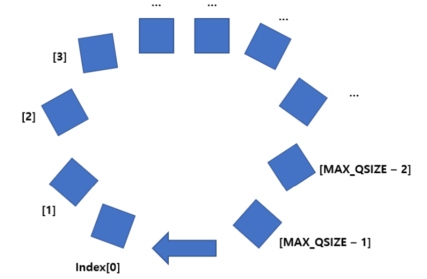
</p>

이 예시는 index 0부터 시작한다. `rear`가 큐의 길이의 끝에 도달(=MAX_QSIZE - 1)하면, 다음 index는 MAX_QSIZE가 아니라 다시 index 0이 된다.

동작 방식은 다음과 같다. front와 rear이 모두 index 0에서 시작한다고 하자.
- 초기 상태에서는 `front = rear = 0`으로 둔다.
- `enqueue(x)`를 하면 먼저 `rear = (rear + 1) % MAX_QSIZE`로 한 칸 이동한 뒤, 해당 위치에 데이터를 저장한다.
- `dequeue()`를 하면 먼저 `front = (front + 1) % MAX_QSIZE`로 한 칸 이동한 뒤, 해당 위치의 데이터를 반환한다.
- front와 rear가 배열 끝에 도달하면 % MAX_QSIZE 연산을 통해 다시 인덱스 0으로 돌아간다.
- front == rear이면 큐가 비어 있는 **공백 상태**이다.
- **공백 상태와 포화 상태를 구분하기 위해 항상 한 칸을 비워 둔다.**
- 따라서 실제 배열 크기가 `MAX_QSIZE`라면 저장 가능한 데이터 개수는 `MAX_QSIZE - 1`개이다.
- `front == (rear + 1) % MAX_QSIZE`이면 더 이상 삽입할 수 없는 **포화 상태**이다.

포화 상태를 판단하려면 큐의 크기를 미리 결정해야 한다. 즉, 원형 큐는 크기가 고정되어 있다.

위의 동작 방식을 보면, `% MAX_QSIZE`는 **index를 `0 ~ MAX_QSIZE-1` 범위 안에서 계속 순환시키는 역할**을 한다.
- `rear = (rear + 1) % MAX_QSIZE`
    -`rear를 원형으로 한 칸 앞으로 이동시키는 식`이다.
    - 마지막 인덱스에서도 자동으로 0으로 돌아온다. (예: `rear`=4, 크기 5라면, `(4+1) % 5 =0`
- `front = (front + 1) % MAX_QSIZE`
    - 동일한 원리로 `front`를 원형으로 한 칸 앞으로 이동시킨다.
    - 그래서 dequeue를 반복해도 배열 끝을 넘어가지 않는다.
- `front == (rear + 1) % MAX_QSIZE`
    - `(rear + 1) % MAX_QSIZE`를 계산하면 `rear`의 다음 위치가 나온다.
    - 그 위치가 `front`라면, `rear`가 한 칸 더 가는 순간 `front`와 겹친다.
    - `front == rear`는 이미 빈 큐를 나타내는 데 사용하므로, 이 방식에서는 **겹치기 직전 상태를 포화로 정의**하고 한 칸을 비워 둔다.


---

## #7. 덱 (Deque)

덱은 "double ended queue" 의 줄임말로, **front와 rear에서 모두 삽입과 삭제가 가능한 queue**이다. 즉, 양방향에서 삽입과 삭제 연산이 가능하다.

덱의 구조는 다음과 같이 queue이지만, stack과 queue의 성질을 모두 가지고 있어 stack이나 queue보다는 입출력이 자유롭다.


```
     addFront ↓                   ↓ addRear
              ┌────┬────┬────┬────┐
              │ 10 │ 20 │ 30 │ 40 │
              └────┴────┴────┴────┘
  deleteFront ↑                   ↑ deleteRear
             front               rear
```

`collections.deque`를 사용하면, 양 끝(front와 rear)에서의 삽입과 삭제 연산의 시간복잡도는 **모두 $O(1)$** 이다.

---

## #8. 트리 (Tree)

트리는 그래프(graph)의 일종으로, 정확히는 **연결되어 있으면서 사이클이 없는 무방향 그래프**이며 계층 구조를 표현하는 비선형 자료구조이다.

트리는 노드(node, 또는 정점 vertex)와 노드들을 연결하는 간선(edge)으로 표현된다.

### #8.1 트리 용어 및 특징

```
                    A          ← 루트 노드, level 1
                  /   \
                 B     C       ← level 2
                / \     \
               D   E     F     ← level 3 (D, E, F는 리프 노드)
```

- `노드 (node)`: 트리를 구성하는 기본 요소.
- `간선 (edge)`: 노드와 노드를 연결하는 선. 부모-자식 관계를 나타낸다.
- `루트 노드 (root node)`: 트리의 가장 최상위에 존재하는, 부모가 없는 유일한 노드. (위 그림의 A)
- `부모 노드 (parent node)`: 어떤 노드와 간선으로 직접 연결된 노드 중 **한 단계 위**에 있는 노드. (B의 부모는 A)
- `자식 노드 (child node)`: 어떤 노드와 간선으로 직접 연결된 노드 중 **한 단계 아래**에 있는 노드. (A의 자식은 B, C)
- `형제 노드 (sibling node)`: 같은 부모 노드를 갖는 노드들. (B와 C, D와 E)
- `조상 노드 (ancestor)` / `후손 노드 (descendant)`: 위/아래로 이어진 모든 노드. (D의 조상은 B, A)
- `단말 노드 (terminal node) / 리프 노드 (leaf node)`: 자식 노드가 하나도 없는 노드. (D, E, F)
- `서브트리 (sub tree)`: 어떤 노드와 그 노드의 모든 후손 노드를 모은 것. 그 자체로 다시 하나의 트리가 되며, **기준이 된 노드가 그 서브트리의 루트**가 된다.
  - 즉, 모든 노드는 자기 자신을 루트로 하는 서브트리의 루트로 볼 수 있다. 트리가 **재귀적 구조**라는 뜻이다.
- `경로 (path)`: 한 노드에서 다른 노드까지 이동할 때 거치는 **간선들의 순서(나열)**. 트리에서 두 노드 사이의 경로는 항상 유일하다.
- `경로의 길이 (path length)`: 그 경로에 포함된 간선의 개수.
- `차수 (degree)`
  - `노드의 차수`: 어떤 노드가 가지고 있는 자식 노드의 수. (A의 차수 = 2, C의 차수 = 1, D의 차수 = 0)
  - `트리의 차수`: 트리에 있는 노드들의 차수 중 가장 큰 값.
- `깊이 (depth)`: 루트 노드에서 특정 노드까지 도달하기 위해 거쳐야 하는 **간선의 수**. 
    - 루트의 깊이는 0이다.
- `레벨 (level)`: 트리의 각 층에 붙이는 번호. 한 층 내려갈 때마다 1씩 증가한다.
    - 보통 레벨은 0 또는 1으로 시작
- `높이 (height)`: 트리의 최대 레벨.

트리의 특징은 다음과 같다.
- 반드시 하나의 루트 노드가 존재한다.
- 루트를 제외한 모든 노드는 **정확히 하나의 부모 노드**를 가진다.
- 서로 다른 임의의 두 노드를 연결하는 edge는 유일하다.
- **노드가 $n$개인 트리는 항상 $n-1$개의 간선을 가진다.**
  - 루트를 제외한 $n-1$개의 노드가 각각 자신의 부모와 이어지는 간선을 정확히 하나씩 갖기 때문이다.

---

## #9. 이진 트리 (Binary Tree)

이진 트리는 **모든 노드가 최대 2개의 서브트리를 갖는 트리**이다. 즉, 자식 노드를 최대 2개까지 가질 수 있으므로 이진 트리를 구성하는 **모든 노드의 차수는 0 이상 2 이하**이다.
- 자식 노드들 사이에도 순서가 존재하기 때문에 왼쪽 자식 노드와 오른쪽 자식 노드를 반드시 구분해야 한다.

이진 트리의 모든 서브트리도 이진 트리이다. 즉, 이진 트리는 **재귀적 구조**를 갖는다.

이진 트리의 재귀적 정의는 다음과 같다.
$$
\text{이진트리}
\quad
\left\{
\begin{array}{l}
\varnothing \quad \text{(노드가 아무것도 없는 경우에도 이진트리)}
\\[1.5em]
\text{루트 노드와 왼쪽 서브트리, 오른쪽 서브트리로 구성된 노드들의 집합.}
\\
\text{이진트리의 서브트리들은 모두 이진트리}
\end{array}
\right.
$$

즉, 이진 트리는 공집합(아무것도 없는 트리)도, 노드와 그 노드의 자식이 하나 있는 트리도 이진트리가 된다.
- 왜 공집합도 이진 트리인가? 
- 공집합이 없으면 트리 전체의 재귀적 성질이 깨진다. 공집합을 이진 트리로 인정하지 않으면 "자식이 없는 노드"를 정의 2로 설명할 수 없고, "자식이 0개인 경우 / 1개인 경우 / 2개인 경우"를 전부 예외 처리해야 한다.

이진 트리는 형태와 특징에 따라 여러 종류로 나뉘며, 대표적으로 full binary tree, perfect binary tree, complete binary tree, balanced binary tree 등이 있다. 

### #9.1 Full Binary Tree
**모든 노드의 자식 수가 0개 또는 2개**인 이진 트리. 즉, 자식이 1개뿐인 노드가 없다.

리프들이 같은 레벨에 있을 필요는 **없다.** 그래서 **높이만으로 노드 개수가 결정되지 않는다.**

```
        A
      /   \
     B     C          ← 모든 노드의 자식이 0개 또는 2개 → 정 이진 트리
          / \
         D   E

높이 h = 3, 노드 개수 = 5  →  $2^3 - 1 = 7$ 이 아니다!
```

### #9.2 Perfect Binary Tree
**모든 노드가 두 개의 자식 노드를 가지는** 이진 트리. 

모든 노드가 두 개의 자식을 가지기 때문에 **모든 리프가 동일한 레벨(깊이)에 있다.**

```
        A                level 1 : $2^0$ = 1개
      /   \
     B     C             level 2 : $2^1$ = 2개
    / \   / \
   D   E F   G           level 3 : $2^2$ = 4개
```

각 레벨의 노드 수가 정확히 정해지므로, 트리의 높이에 따라 전체 노드 개수도 하나로 정해진다.
- level $k$의 노드 개수 = $2^{k-1}$개
- 높이가 $h$인 포화 이진 트리의 전체 노드 개수:$\sum_{k=1}^{h} 2^{k-1} = 2^0 + 2^1 + \dots + 2^{h-1} = 2^h - 1$

### #9.3 Complete Binary Tree
완전 이진 트리는 **마지막 레벨을 제외한 나머지 레벨(level 1 ~ level $h-1$)에는 노드가 모두 채워져 있고, 마지막 레벨 $h$는 노드가 왼쪽부터 오른쪽으로 순서대로 채워진** 이진 트리이다.

정리하면 두 조건이다.

1. 마지막 레벨 위쪽은 **빈 자리가 하나도 없어야 한다.**
2. 마지막 레벨은 **다 채워져 있지 않아도 되지만, 반드시 왼쪽부터** 채워져야 하고 중간에 빈 노드가 있으면 안 된다.

```
[완전 이진 트리 O]          [완전 이진 트리 X]
        A                          A
      /   \                      /   \
     B     C                    B     C
    / \   /                    / \     \
   D   E F                    D   E     G
                                        ↑ 왼쪽(F 자리)이 비었는데 오른쪽이 채워짐
```

노드 개수 범위: $2^{h-1} \le n \le 2^h - 1$

full, perfect, complete binary tree의 포함 관계는 다음과 같다.
```
   ┌─────────── 이진 트리 ───────────┐
   │  ┌──   full   ──┐               │
   │  │   ┌───────┐  │               │
   │  │   │       │  │               │
   │  │   │perfect│  │               │
   │  │   └───────┘  │               │
   │  └──────┼───────┘               │
   │    ┌────┴──────────┐            │
   │    │   complete    │            │
   │    └───────────────┘            │
   └─────────────────────────────────┘
```
- **perfect ⊂ complete**: perfect binary tree는 모든 레벨이 꽉 찼으니 당연히 complete binary tree의 조건을 만족한다.
- **perfect ⊂ full**: 모든 내부 노드가 자식 2개를 가지므로 full binary tree이기도 하다.
- **complete ⊄ perfect**: 마지막 레벨이 다 안 차 있어도 complete binary tree다. 예를 들어 level $h-1$까지가 포화 형태여도 level $h$에 노드가 1개만 있으면 complete binary tree는 되지만 perfect binary tree는 아니다.
- **complete ⊄ full, full ⊄ complete**: 두 개념은 서로 포함 관계가 아니다.
  - complete지만 full이 아닌 예: 마지막에서 두 번째 노드가 왼쪽 자식만 갖는 경우 (자식 수가 1개)
  - full이지만 complete이 아닌 예: 위 Perfect의 그림 (B가 리프인데 C는 자식 2개를 가짐)


### #9.4 이진 트리의 성질
**(1) 노드가 $n$개이면 간선은 $n-1$개이다.**

루트 노드를 제외한 모든 노드는 부모 노드를 가지며, 부모-자식 사이에는 간선이 정확히 하나 존재하기 때문이다.

**(2) 높이가 $h$인 이진 트리의 노드 개수는 $h$개 이상 $2^h - 1$개 이하이다.**

- 높이가 $h$라면 최대 레벨이 $h$다.
- 트리의 한 레벨에는 적어도 하나의 노드가 존재해야 한다. 그러므로 높이가 $h$라면 최소한 $h$개의 노드를 가진다. (한 줄로 늘어선 **편향 트리(skewed tree)** 가 이 경우다.)
- 노드 개수가 가장 많은 경우는 perfect binary tree이며, 그 개수는 $2^h - 1$개다.

$$h \le n \le 2^h - 1$$

**(3) 노드가 $n$개인 이진 트리의 높이는 $\log_2 (n+1)$ 이상 $n$ 이하이다.**

(2)의 부등식 $h \le n \le 2^h - 1$을 $h$에 대해 풀면 된다.

- 왼쪽 $h \le n$: 레벨 하나에는 최소 노드 1개가 있어야 하므로, 노드가 $n$개면 높이가 $n$을 초과할 수 없다. 
- 오른쪽 $n \le 2^h - 1$: 이진 트리의 노드 개수는 $h \le \text{노드 개수} \le 2^h-1$이다. 그러므로, 노드 개수가 $n$개라면 $h \le n \le 2^h-1$이 성립한다. 여기서 $h \le n$은 앞서 말한, "노드 개수가 $n$개라면 높이가 $n$을 초과할 수 없다"에 해당된다. $n \le 2^h-1$은 $n + 1 \le 2^h$이며 밑이 2인 로그를 취하면 $\log_2 (n+1) \le h$가 된다. 그러므로 $n$개의 노드를 가지는 이진 트리의 높이는 $\log_2 (n+1) \le h \le n$가 성립한다.

$$\log_2 (n+1) \le h \le n$$

> 이는 트리의 **균형이 잡히면 높이가 $\log_2 n$ 수준으로 줄고, 편향되면 $n$까지 늘어남을 의미한다. 

### #9.5 이진 트리의 구현
이진 트리는 **배열 표현법**과 **링크(연결) 표현법**으로 구현할 수 있다.

#### #9.5.1 배열 표현법
트리를 위에서 아래로, 각 레벨에서는 왼쪽에서 오른쪽 순서로 번호를 매기고, 이 번호를 배열의 index로 사용한다. 중간에 노드가 없어면 그 자리는 비워 둔다.

배열 표현법은 index 0을 사용하느냐 index 1부터 사용하느냐에 따라 구현이 약간 달라진다. 

**index 1부터 사용하는 경우**

```
         A(1)
        /    \
      B(2)   C(3)
      /  \      \
    D(4) E(5)   G(7)

index:  0     1     2     3     4     5     6     7
      [  -  ][ A ][ B ][ C ][ D ][ E ][  -  ][ G ]
        미사용                          빈 자리
```

| 관계 | 인덱스 계산 |
|:---|:---|
| 노드 $i$의 부모 | $i // 2$ |
| 노드 $i$의 왼쪽 자식 | $2i$ |
| 노드 $i$의 오른쪽 자식 | $2i + 1$ |

**index 0부터 사용하는 경우**

```
         A(0)
        /    \
      B(1)   C(2)
      /  \      \
    D(3) E(4)   G(6)

index:  0     1     2     3     4     5     6
      [ A ][ B ][ C ][ D ][ E ][  -  ][ G ]
```

| 관계 | 인덱스 계산 |
|:---|:---|
| 노드 $i$의 부모 | $(i - 1) // 2$ |
| 노드 $i$의 왼쪽 자식 | $2i + 1$ |
| 노드 $i$의 오른쪽 자식 | $2i + 2$ |

**장점**

- 인덱스만 알면 부모/자식을 **계산만으로** 찾을 수 있어 접근이 $O(1)$이다.
- 포인터를 저장하지 않으므로 메모리 오버헤드가 없고, 연속 메모리라 캐시 효율이 좋다.

**단점**

- **편향 트리에서 메모리 낭비가 극심하다.** 배열 크기는 높이에 따라 $2^h - 1$을 확보해야 하기 때문이다.

```
높이 4, 노드 4개인 편향 트리
  A(1)
    \
     B(3)
       \
        C(7)
          \
           D(15)

→ 배열은 index 15까지(= $2^4 - 1$칸) 필요한데 실제로 쓰는 건 4칸뿐
```

- 트리의 모양이 자주 바뀌면 인덱스를 다시 계산해야 해서 비효율적이다.

그래서 배열 표현법은 **완전 이진 트리(왼쪽부터 오른쪽 순서대로 채우며, 빈 자리가 생기지 않음)** 에 쓰는 것이 적합하다.

#### #9.5.2 링크 표현법

연결된 구조로 이진 트리를 표현하려면 왼쪽 자식과 오른쪽 자식을 가리키기 위해 **2개의 링크가 필요하다.**: left, right

```
┌──────┬──────┬──────┐
│ left │ data │ right│
└──┬───┴──────┴───┬──┘
   ↓              ↓
 왼쪽 자식     오른쪽 자식
```

```python
class Node:
    def __init__(self, data):
        self.data = data
        self.left = None
        self.right = None
```

자식 노드가 없는 경우 링크가 아무것도 가리키지 않게(즉, `None`으로) 설정하면 된다. 이 `None`이 앞서 말한 **공집합 이진 트리**에 해당한다.

**장점**: 편향 트리여도 필요한 노드만큼만 메모리를 쓴다. 삽입/삭제 시 링크만 바꾸면 된다.
**단점**: 노드마다 포인터 2개의 추가 공간이 필요하고, 부모로 거슬러 올라가려면 별도의 `parent` 링크가 있어야 한다.

### #9.6 이진 트리의 순회 (Traversal)

순회란 **트리에 있는 모든 노드를 한 번씩 방문하는 것**을 말한다.

이진 트리는 각 서브트리도 이진 트리로 재귀적이다. 따라서 **전체 트리에 적용한 방문 규칙을 서브트리에도 그대로 적용**할 수 있다.


#### #9.6.1 Preorder, Inorder, Postorder

대표적인 순회는 **전위(preorder), 중위(inorder), 후위(postorder)** 이며, 셋의 차이는 **루트를 언제 방문하느냐** 하나뿐이다.

| 순회 | 방문 순서 | 루트 방문 시점 |
|:---|:---|:---|
| `전위 (preorder)` | 루트 → 왼쪽 서브트리 → 오른쪽 서브트리 | 먼저 |
| `중위 (inorder)` | 왼쪽 서브트리 → 루트 → 오른쪽 서브트리 | 중간 |
| `후위 (postorder)` | 왼쪽 서브트리 → 오른쪽 서브트리 → 루트 | 마지막 |

왼쪽 서브트리와 오른쪽 서브트리도 이진 트리이므로, 그 안에서도 **같은 순서 규칙이 반복**된다.

#### 예시

```
        A
      /   \
     B     C
    / \   /
   D   E F
```

| 순회 | 결과 |
|:---|:---|
| `전위` | A → B → D → E → C → F |
| `중위` | D → B → E → A → F → C |
| `후위` | D → E → B → F → C → A |
| `레벨` | A → B → C → D → E → F |

전위 순회를 예로 풀어 보면 다음과 같다.

1. 루트 A를 방문한다.
2. 왼쪽 서브트리(B가 루트)로 간다. 여기서도 규칙이 같으므로 루트 B를 먼저 방문한다.
3. B의 왼쪽 서브트리(D)로 간다. D를 방문한다. D는 자식이 없으므로(= 서브트리가 공집합) 돌아온다.
4. B의 오른쪽 서브트리(E)로 간다. E를 방문하고 돌아온다.
5. B의 서브트리를 다 돌았으므로 A의 오른쪽 서브트리(C)로 간다. C를 방문한다.
6. C의 왼쪽 서브트리(F)를 방문한다. C의 오른쪽 서브트리는 공집합이므로 종료한다.

#### #9.6.2 레벨 순회 (level-order)

레벨 순회는 **각 노드를 낮은 레벨부터 차례대로, 같은 레벨에서는 왼쪽에서 오른쪽 순으로 방문하는 방법**으로, 너비 우선 순회(breadth-first traversal)라고도 한다.

레벨 순회는 먼저 루트 노드를 넣고, 루트 노드를 꺼내 방문한다. 그리고 좌에서 우, 루트의 왼쪽 자식부터 오른쪽 자식 순으로 삽입하고 이들을 꺼내 방문한다. 자식이 없으면 삽입하지 않는다.

레벨 순회는 선입선출의 특성으로 노드를 방문하기 때문에 재귀를 사용하는 것보다 큐를 사용하는 것이 바람직하다. 즉,  **방문 순서 자체가 FIFO라서 큐가 구조적으로 맞는 것**이다. 

큐를 사용한다면 동작은 다음과 같다. 

1. 큐에 루트 노드를 넣는다.
2. 큐에서 노드를 하나 꺼내 방문한다.
3. 그 노드의 왼쪽 자식, 오른쪽 자식 순서로 큐에 넣는다. 자식이 없으면 넣지 않는다.
4. 큐가 빌 때까지 2~3을 반복한다.

---

## #10. 이진 탐색 트리 (Binary Search Tree)

BST는 **이진 트리 구조를 이용해 효율적인 탐색을 하기 위한 비선형 자료구조**이다.


### #10.1 정의

BST는 다음 성질을 가지며 **재귀적으로** 정의된다.

- 모든 노드는 유일한 key(서로 다른 key)를 갖는다.
- 왼쪽 서브트리의 모든 key는 루트의 key보다 **작다.**
- 오른쪽 서브트리의 모든 key는 루트의 key보다 **크다.**
- 왼쪽 서브트리와 오른쪽 서브트리도 각각 BST이다.

$$\text{왼쪽 서브트리의 모든 key} < \text{루트의 key} < \text{오른쪽 서브트리의 모든 key}$$

<p align="center">
  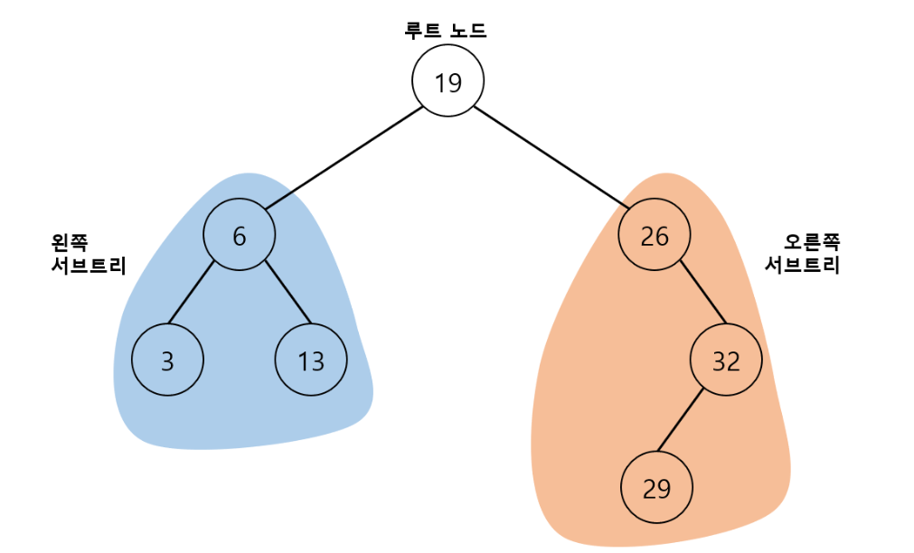
</p>

> **핵심은 "자식"이 아니라 "서브트리 전체"** 라는 점이다. 루트의 왼쪽 자식 하나만 작으면 되는 게 아니라, 왼쪽 서브트리에 속한 **모든** 노드가 루트보다 작아야 한다. 그리고 재귀적 정의이므로 이 조건이 모든 서브트리에서 똑같이 성립해야 한다.

```
         8
       /   \
      3     10
     / \      \
    1   6      14
       / \    /
      4   7  13
```

- 8의 왼쪽 서브트리 {3, 1, 6, 4, 7}은 모두 8보다 작다.
- 8의 오른쪽 서브트리 {10, 14, 13}은 모두 8보다 크다.
- 3의 서브트리에서도, 6의 서브트리에서도 같은 조건이 성립한다.

**BST가 아닌 예**

```
         8
       /   \
      3     10
     / \
    1   9      ← 9는 3의 오른쪽 자식이라 조건을 만족하는 것 같지만,
                  8의 왼쪽 서브트리에 있으면서 8보다 크므로 BST가 아니다.
```

### #10.2 BST를 중위 순회하면 오름차순이 된다.

중위 순회는 `왼쪽 → 루트 → 오른쪽` 순서인데, BST에서는 이것이 곧 `작은 값들 → 자기 자신 → 큰 값들` 순서이기 때문이다.

그래서 어떤 트리가 BST인지 검증할 때 이 성질을 사용하면 된다. (중위 순회 결과가 오름차순이면 BST)

### #10.3 노드 구조

여기서는 BST를 key-value 쌍을 저장하는 **Map 형태**로 구현한다. 각 노드는 하나의 (key, value) 엔트리를 저장하며, BST의 구조를 유지하기 위해 왼쪽과 오른쪽 자식 노드를 가리키는 링크도 함께 가진다.

```python
class Node:
    def __init__(self, key, value, left=None, right=None):
        self.key = key
        self.value = value
        self.left = left      # 왼쪽 자식 노드
        self.right = right    # 오른쪽 자식 노드
```

**대소 비교는 오직 `key`로만 한다.** `value`는 `key`에 대응되는 데이터일 뿐 트리의 구조에 아무 영향을 주지 않는다. 

### #10.4 BST의 탐색 연산

#### (1) key를 이용한 탐색

탐색은 항상 루트 노드에서 시작한다. 찾고자 하는 key를 `k`라고 하면, 현재 노드의 key와 `k`를 비교한다.

- **`k == 현재 노드의 key`**: 탐색 성공
- **`k < 현재 노드의 key`**: BST의 정의(왼쪽 서브트리 < 루트 < 오른쪽 서브트리)에 의해 `k`는 **왼쪽 서브트리에만** 있을 수 있다. → 왼쪽 자식을 새 루트로 삼아 다시 탐색
- **`k > 현재 노드의 key`**: 같은 이유로 `k`는 **오른쪽 서브트리에만** 있을 수 있다. → 오른쪽 자식을 새 루트로 삼아 다시 탐색

<p align="center">
  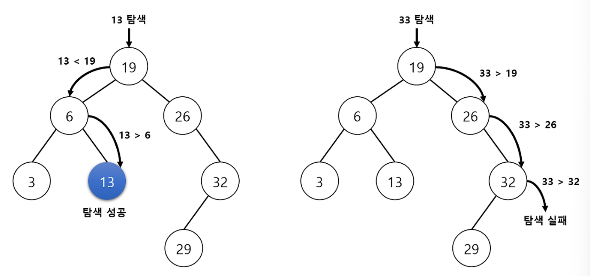
</p>

예를 들어 위 트리에서 `k = 13`을 탐색하면
- `13 < 19`이므로 루트의 왼쪽 서브트리로 이동한다.
- `13 > 6`이므로 그 서브트리의 오른쪽 서브트리로 이동한다.
- `13 == 13`이므로 탐색 성공.

반대로 트리에 없는 key를 탐색하면, 언젠가 **더 내려갈 자식이 없는 지점(`None`)에 도달**한다. 예를 들어 `k = 33`은 `33 > 32`라서 32의 오른쪽으로 가야 하는데 오른쪽 자식이 없으므로 탐색 실패다.

> **탐색 실패 지점이 곧 삽입 위치**다. 이것이 BST의 삽입 연산이 탐색과 완전히 같은 경로를 따르는 이유다.

```python
# 재귀 구조
def search(root, key):
    if root is None:              
        return None
    elif key == root.key:
        return root
    elif key < root.key:
        return search(root.left, key)
    else:
        return search(root.right, key)


# 반복 구조
def search(root, key):
    while root is not None:
        if key == root.key:
            return root
        elif key < root.key:
            root = root.left
        else:
            root = root.right
    return None
```

#### (2) value를 이용한 탐색

엔트리의 값으로도 탐색할 수 있다.

```python
def search_value(root, value):
    if root is None:
        return None
    elif value == root.value:
        return root

    node = search_value(root.left, value)     # 왼쪽 서브트리 탐색
    if node is not None:                      # 탐색 성공이면
        return node
    else:                                     # 실패면 오른쪽 서브트리 탐색
        return search_value(root.right, value)
```

**이 탐색은 $O(n)$이다.** BST는 key를 기준으로만 정렬되어 있고 value에 대해서는 아무 순서도 없기 때문에, 어느 쪽 서브트리로 가야 할지 판단할 근거가 없다. 결국 **트리 전체를 전위 순회하는 것**과 같다.

#### (3) 최소·최대 key 탐색

**이진 탐색 트리의** 정의상 최소 key는 트리의 가장 왼쪽 끝에, 최대 key는 가장 오른쪽 끝에 있다.

- 어떤 노드에서든 왼쪽 서브트리의 모든 값은 자신보다 작으므로, **왼쪽으로만 계속 내려가면** 최솟값에 도달한다.
- 마찬가지로 **오른쪽으로만 계속 내려가면** 최댓값에 도달한다.

```python
def search_min_key(root):
    while root is not None and root.left is not None:
        root = root.left
    return root


def search_max_key(root):
    while root is not None and root.right is not None:
        root = root.right
    return root
```

### #10.5 BST의 삽입 연산

BST는 삽입 후에도 BST의 정의를 만족해야 한다.

삽입은 **탐색과 완전히 같은 경로를 따른다.** 현재 노드보다 key가 작으면 왼쪽으로, 크면 오른쪽으로 내려가다가 **처음 만나는 `None` 자리가 삽입 위치**가 된다.

<p align="center">
  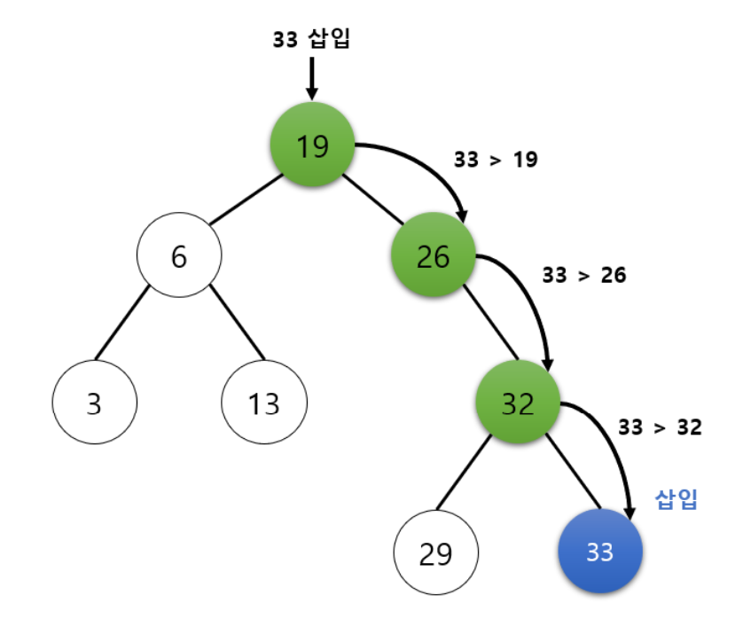
</p>

중복 key의 처리 방식은 구현에 따라 다르다. 중복을 허용하지 않는 BST에서는 같은 key를 만나면 삽입하지 않는다.

```python
def insert(root, new_node):
    if new_node.key < root.key:
        if root.left is None:
            root.left = new_node # 빈 자리 → 여기에 삽입
            return True
        else:
            return insert(root.left, new_node)

    elif new_node.key > root.key:
        if root.right is None:
            root.right = new_node
            return True
        else:
            return insert(root.right, new_node)

    else: # 중복 key
        return False
```

- 삽입할 노드의 key가 현재 노드의 key보다 작으면 삽입 위치는 왼쪽 서브트리에, 크면 오른쪽 서브트리에 있다. 이 과정을 삽입 위치를 찾을 때까지 재귀적으로 반복한다.
- 왼쪽(오른쪽) 자식이 비어 있으면 그 자리에 노드를 삽입하고, 비어 있지 않으면 그 자식을 루트로 삼아 다시 삽입 연산을 진행한다.

### #10.6 BST의 삭제 연산

삭제 연산도 삭제 후 BST의 정의를 만족해야 한다. **삭제하려는 노드의 자식 수에 따라 세 가지 경우**로 나누어 처리한다.

1. 자식이 **0개**인 경우 (리프 노드)
2. 자식이 **1개**인 경우
3. 자식이 **2개**인 경우

#### (1) 삭제할 노드가 리프 노드인 경우

가장 간단하다. 자식이 없으므로 그냥 떼어내도 BST의 정의가 깨지지 않는다. 삭제할 노드를 가리키던 부모의 링크를 `None`으로 바꿔 트리에서 분리한다.

```python
def delete_leaf_node(root, parent, delete_node):
    if parent is None:                    
        return None

    if parent.left is delete_node:
        parent.left = None
    elif parent.right is delete_node:
        parent.right = None

    return root
```

#### (2) 삭제할 노드가 자식을 1개만 가지는 경우

노드를 삭제한 뒤, **삭제된 노드의 서브트리를 부모에게 그대로 이어 붙인다.**

이렇게 해도 되는 이유는, 삭제할 노드가 부모의 왼쪽에 있었다면 그 서브트리 전체도 부모보다 작기 때문이다. 그래서 이어 붙이면 대소 관계가 그대로 유지된다.

<p align="center">
  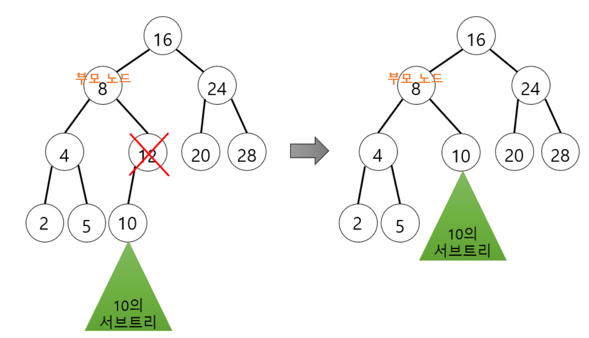
</p>

```python
def delete_node_with_one_child(root, parent, delete_node):
    if delete_node.left is not None:
        child = delete_node.left
    else:
        child = delete_node.right

    if delete_node is root:               
        root = child
    else:
        if delete_node is parent.left:
            parent.left = child
        else:
            parent.right = child

    return root
```

#### (3) 삭제할 노드가 자식을 2개 가지는 경우

한쪽 자식만 부모와 연결하는 방법으로는 BST 정의를 유지할 수 없다. 나머지 한쪽 서브트리를 붙일 자리가 없기 때문이다. 그래서 **삭제할 노드의 자리를 대신 채울 노드**를 골라야 한다.

**대체 노드 후보는 두 가지다.**

- **왼쪽 서브트리의 최댓값** = 선행자(predecessor)
- **오른쪽 서브트리의 최솟값** = 후속자(successor)

이 둘이 답인 이유는 **정렬 순서상 삭제할 key의 바로 앞 값과 바로 뒷값**이기 때문이다.

- 왼쪽 서브트리의 최댓값은 "삭제할 key보다 작은 값들 중 가장 큰 값"
- 오른쪽 서브트리의 최솟값은 "삭제할 key보다 큰 값들 중 가장 작은 값"

어떤 값을 빼낸 자리에는 **그 바로 옆 값**을 넣어야 나머지 전부와의 대소 관계가 그대로 유지된다.

**대체 노드는 자식이 1개 이하일 수밖에 없다.**
- 오른쪽 서브트리의 최솟값에 **왼쪽 자식이 있다면**, 그 자식이 더 작은 값이므로 최솟값이라는 전제와 모순이다. 따라서 **왼쪽 자식을 절대 가질 수 없다.**
- 왼쪽 서브트리의 최댓값도 같은 이유로 **오른쪽 자식을 절대 가질 수 없다.**

```python
def search_min_with_parent(node, parent=None):
    current = node
    while current.left is not None:
        parent = current
        current = current.left
    return parent, current


def search_max_with_parent(node, parent=None):
    current = node
    while current.right is not None:
        parent = current
        current = current.right
    return parent, current


def delete_node_with_two_child(root, delete_node):
    # 오른쪽 서브트리의 최솟값(후속자)을 대체 노드로 선택
    replace_parent, replace = search_min_with_parent(
        delete_node.right,
        delete_node,        
    )

    # 후속자는 왼쪽 자식이 없으므로 오른쪽 자식만 이어 붙이면 된다
    if replace_parent.left is replace:
        replace_parent.left = replace.right
    else:
        replace_parent.right = replace.right

    # 노드를 옮기는 대신 값만 복사한다
    delete_node.key = replace.key
    delete_node.value = replace.value

    return root
```

탐색·삽입·삭제 모두 **루트에서 출발해 아래로 한 레벨씩만 내려간다**는 공통점이 있다.

탐색을 예로 보면, 찾는 key를 현재 노드와 비교했을 때

- 같으면 → 탐색 종료
- 작으면 → **오른쪽 서브트리는 통째로 버리고** 왼쪽으로 내려간다
- 크면 → **왼쪽 서브트리는 통째로 버리고** 오른쪽으로 내려간다

한 번 비교할 때마다 후보의 한쪽을 전부 제거하고 한 레벨 내려가므로, **비교 횟수는 아무리 많아도 트리의 높이 $h$를 넘지 않는다.** 그래서 탐색·삽입·삭제 연산이 $O(h)$다.

- 삽입도 같은 방식으로 내려가다가 `None`을 만난 자리에 새 노드를 붙이면 되므로 $O(h)$.
- 삭제도 삭제할 노드를 찾는 데 $O(h)$, 자식이 둘인 경우 대체할 노드(오른쪽 서브트리의 최솟값 또는 왼쪽 서브트리의 최댓값)를 찾는 데 다시 $O(h)$이므로 전체 $O(h)$.

### #10.7 편향 트리 문제

이미 정렬된 데이터를 순서대로 삽입하면 BST는 한쪽으로만 자라 **연결 리스트와 똑같은 모양**이 된다.

```
1, 2, 3, 4, 5 순서로 삽입하면

  1
   \
    2
     \
      3
       \
        4
         \
          5

높이 h = 5 = n  →  탐색이 $O(n)$
```
이 경우 트리를 쓰는 의미가 사라진다. 그래서 삽입/삭제 시 스스로 균형을 맞춰 높이를 $O(\log n)$으로 유지하는 **균형 이진 탐색 트리**를 사용한다.

---

## #11. 균형 이진 탐색 트리와 AVL 트리

균형 이진 트리는 **모든 노드의 왼쪽 서브트리와 오른쪽 서브트리의 높이 차이가 일정 수준(주로 1이하)을 넘지 않도록 유지하는 이진 트리**를 말한다. 대표적인 구현으로 AVL 트리, 레드-블랙 트리가 있다. 

일반적인 BST는 데이터가 한쪽으로 치우쳐 저장되면 트리의 높이 차이가 커져, 최악의 경우 탐색 시간이 $O(n)$까지 증가할 수 있다. 균형 이진 트리는 이러한 문제를 완화하기 위해 트리의 높이를 가능한 한 작게 유지한다. 

AVL 트리와 같은 균형 이진 탐색 트리는 트리의 높이를 $O(\log n)$으로 유지하여 탐색, 삽입, 삭제 연산의 시간복잡도를 $O(\log n)$을 보장한다. 

### #11.1 AVL 트리와 균형 인수

<p align="center">
  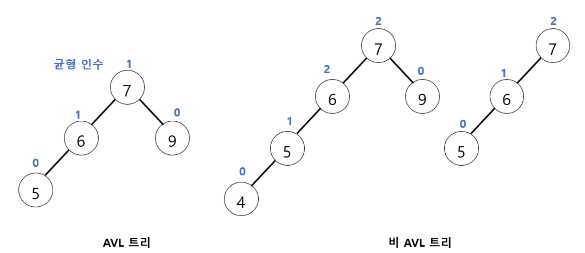
</p>

**균형 인수(balance factor)** 는 **왼쪽 서브트리의 높이와 오른쪽 서브트리의 높이 차**를 뜻한다.

**AVL 트리는 모든 노드의 균형 인수가 $-1, 0, +1$ 중 하나인 이진 탐색 트리**다.

| 균형 인수 | 의미 |
|:---:|:---|
| $0$ | 왼쪽과 오른쪽 높이가 같음 |
| $+1$ | 왼쪽 서브트리가 1 더 높음 |
| $-1$ | 오른쪽 서브트리가 1 더 높음 |
| $\pm 2$ | **균형 조건이 깨진 상태** → 재조정 필요 |

AVL 트리는 BST이므로 **탐색 연산은 BST와 완전히 동일**하다. 주의할 것은 삽입과 삭제다. 수행 결과 균형 조건이 깨질 수 있기 때문이다.

균형 인수는 왼쪽과 오른쪽 서브트리의 높이 차이를 이용하므로, 먼저 서브트리의 높이를 구하는 함수가 필요하다. 아래 구현은 주어진 노드를 루트로 하는 서브트리의 높이를 계산하는 함수이다.

```python
def calc_height(node):
    if node is None:
        return 0

    left_height = calc_height_wrong(node.left)
    right_height = calc_height_wrong(node.right)

    return max(left_height, right_height) + 1


def calc_balance_factor(node):
    if node is None: 
        return 0

    left = calc_height(node.left)
    right = calc_height(node.right)

    return left - right
```

### #11.2 회전 (Rotation)
새로운 노드가 삽입/삭제되면, 삽입/삭제된 위치부터 루트 노드까지의 경로에 있는 모든 조상 노드들의 균형 인수가 영향을 받는다.

AVL 트리의 균형 조건을 유지하기 위해서는, **삽입 후 균형 인수가 -2 or +2로 변한 가장 가까운 조상 노드의 서브트리에 대해 다시 균형을 잡아줘야 한다.** 문제가 되는 부분만 균형을 다시 잡으면 균형 조건이 유지되기 때문에 다른 노드들은 변경할 필요가 없다.

아래 예시는 노드 `4`가 삽입되면서 조상 노드 `6`과 `7`의 균형 인수가 2가 되어 AVL 트리의 균형 조건이 깨진 경우이다.

<p align="center">
  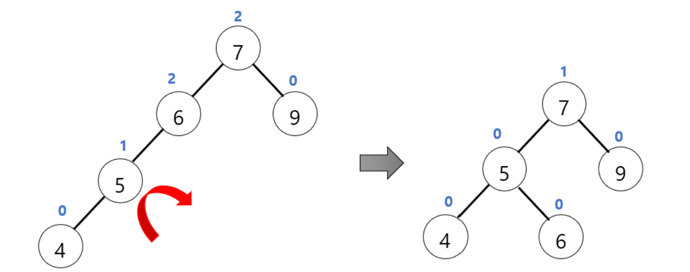
</p>


AVL 트리에서는 삽입된 노드에서 루트 방향으로 올라가며 처음으로 균형이 깨진 조상 노드, 즉 **삽입 노드와 가장 가까운 불균형 조상을 찾아 균형을 복구**한다. 이 예시에서는 노드 `6`이 이에 해당한다.


**다시 균형을 잡는 방법으로 서브트리를 회전시키는 방법**이 있다. 이 예시는 균형이 깨진 상태에서 노드 `4`, `5`, `6`을 BST 정의를 만족하도록 오른쪽 시계 방향으로 회전시켜 다시 AVL 트리를 만들었다.

트리의 균형을 복구하는 방법으로 **회전**을 사용한다. 이 예시에서는 회전 결과, 노드 `5`가 해당 서브트리의 새로운 루트가 되고, `4`와 `6`이 각각 `5`의 왼쪽 자식과 오른쪽 자식이 된다. 

**이러한 회전은 BST의 key 순서를 유지하면서 AVL 트리의 균형을 복구**한다.

#### 불균형의 네 가지 유형

AVL 트리의 삽입으로 발생하는 불균형은 **삽입 경로의 방향에 따라 네 가지 유형**으로 구분할 수 있다. 새로 삽입된 노드를 N, 삽입된 N으로부터 가장 가까우면서 균형 인수가 ± 2가 된 조상 노드를 A라고 하면,
- ① LL 타입: N이 A의 왼쪽 자식의 왼쪽 서브트리에 삽입
- ② LR 타입: N이 A의 왼쪽 자식의 오른쪽 서브트리에 삽입
- ③ RR 타입: N이 A의 오른쪽 자식의 오른쪽 서브트리에 삽입
- ④ RL 타입: N이 A의 오른쪽 자식의 왼쪽 서브트리에 삽입

각 불균형 유형에 맞는 회전을 수행하여 AVL 트리의 균형을 복구한다. **LL 타입과 RR 타입은 한 번의 회전만으로 균형을 복구할 수 있으며, LR 타입과 RL 타입은 두 번의 회전이 필요하다.** 그리고 이 과정에서 BST 정의를 충족할 수 있도록 부모-자식 노드 관계를 구성해야 한다. 

#### LL 회전
LL 타입은 새로운 노드가 불균형 노드(균형 인수가 ± 2인 노드) A의 왼쪽 자식의 왼쪽 서브트리에 삽입되어 발생한다. 이 경우 A에 **한 번의 오른쪽 회전**을 수행하여 BST 정의를 만족하면서 AVL 트리의 균형을 복구할 수 있다.

아래 그림은 노드 `5`가 삽입되면서 노드 `7`의 균형 인수가 2가 되어 LL 타입의 불균형이 발생한 예시이다. 불균형 

<p align="center">
  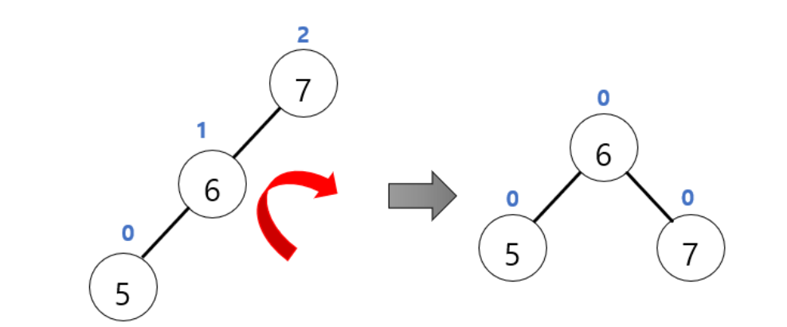
</p>

노드 `7`을 기준으로 한 번의 오른쪽 회전을 수행하면, 노드 `6`이 새로운 루트가 되고 `5`와 `7`이 각각 `6`의 왼쪽과 오른쪽 자식이 되어 AVL 트리의 균형이 복구된다.

아래는 균형을 이루고 있는 상태에서 서브트리 T1에 새로운 노드가 삽입되어 LL 형태의 불균형이 발생한 예시이다. 

<p align="center">
  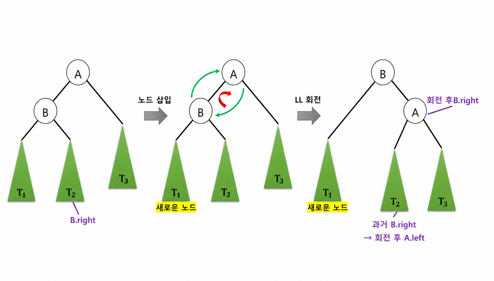
</p>

노드 삽입으로 인해 노드 A가 불균형 노드가 되었다면, 노드 A를 오른쪽으로 회전시키면 된다. 노드 B는 새로운 루트 노드가 되고, 노드 B의 오른쪽 서브트리 T2는 A의 왼쪽 서브트리로 이동한다. 이는 T2의 모든 key가 B보다 크고 A보다 작기 때문에, 회전 후에도 BST 정의를 유지하기 위해서이다.
- BST의 대소 관계를 보면, 원래의 T2는 B의 오른쪽 서브트리이므로 B < T2이고, 동시에 B 전체가 A의 왼쪽 서브트리에 있으므로 T2 역시 T2 < A이다.
- 즉, 전체 관계는 T1 < B < T2  < A < T3이다. 
- A를 오른쪽 회전시키면 A가 B의 오른쪽 자식이 되므로, B보다 크면서 A보다 작은 T2가 들어갈 수 있는 위치는 A의 왼쪽서브트리(`A.left`)이다. 
```python
def LL_Rotation(A):
    B = A.left
    A.left = B.right
    B.right = A
    return B
```

#### RR 회전

RR 타입은 새로운 노드가 불균형 노드 A의 오른쪽 자식의 오른쪽 서브트리에 삽입되어 발생한다. 이 경우 A에 **한 번의 왼쪽 회전**을 수행하여 BST의 정렬 조건을 유지하면서 AVL 트리의 균형을 복구할 수 있다.

<p align="center">
  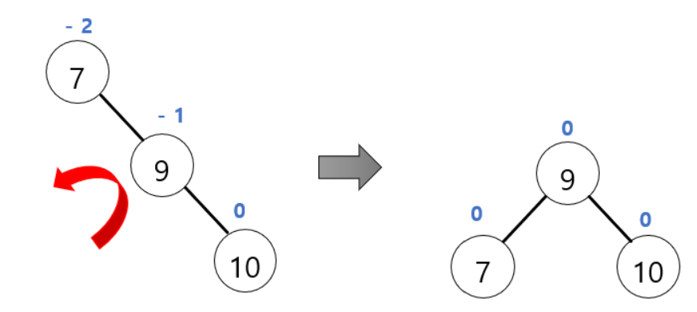
</p>

RR 타입에서는 새로운 노드가 불균형 노드 A의 오른쪽 자식 B의 오른쪽 서브트리에 삽입되어 불균형이 발생한다. 이때 A를 기준으로 한 번의 왼쪽 회전을 수행한다. 

<p align="center">
  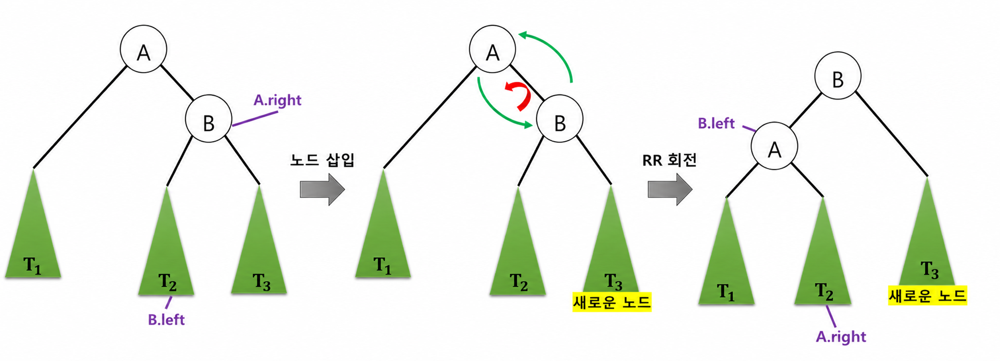
</p>

회전 후 B가 해당 서브트리의 새로운 루트가 되고, A는 B의 왼쪽 자식이 된다. 또한 기존 B의 왼쪽 서브트리인 T2는 A의 오른쪽 서브트리로 이동한다. 이는 BST 정의를 유지하기 위해서이다. 
```python
def RR_Rotation(A):
    B = A.right
    A.right = B.left
    B.left = A
    return B 
```

#### RL 회전
RL 타입은 새로운 노드가 최초의 불균형 노드의 오른쪽 자식의 왼쪽 서브트리에 삽입되어 발생하는 불균형 유형이다. 즉 삽입 경로가 `오른쪽 → 왼쪽` 방향으로 이어지는 경우이다.

즉, 삽입 경로가 `오른쪽 → 왼쪽`으로 꺾이는 경우다. 그래서 RL 타입은 한 번의 회전으로는 균형을 복구할 수 없으므로 **두 번의 회전**을 수행한다. 

아래 그림은 최초의 불균형 노드 `7`의 오른쪽 자식을 오른쪽으로 회전시킨 뒤, `7`을 왼쪽으로 회전시킴으로써 불균형을 해소하는 예시이다. 

<p align="center">
  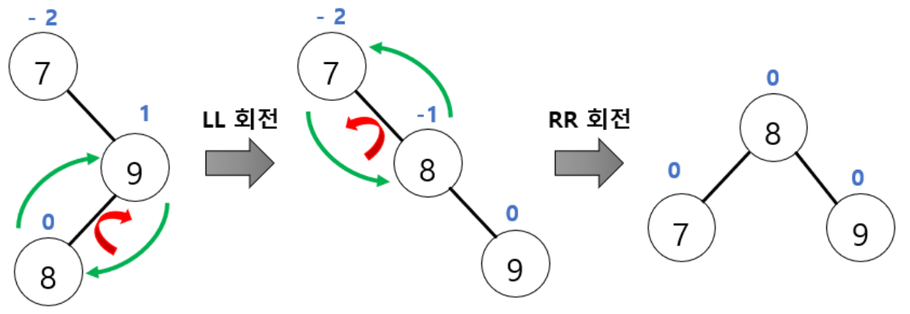
</p>

아래의 RL 타입 예시는 새로운 노드가 불균형 노드 A의 오른쪽 자식 B의 왼쪽 서브트리에 삽입되어 발생한다.

<p align="center">
  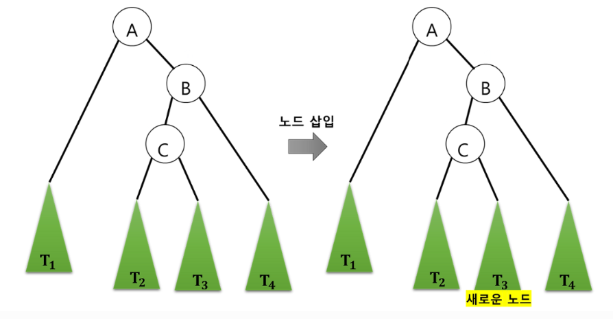
</p>

균형을 다시 맞추기 위해, 먼저 문제가 되는 부분에 RL 회전을 수행한다. 

<p align="center">
  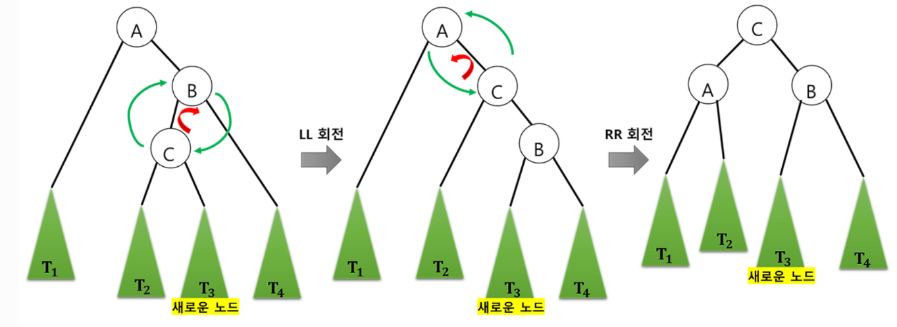
</p>

이 예시의 경우 RL 회전을 통해 A와 B가 각각 C의 왼쪽과 오른쪽 자식이 되며 T1, T2, T3, T4의 key 순서를 유지하면서 AVL 트리의 균형을 복구한다.
```python
def RL_Rotation(A):
    B = A.right
    A.right = LLRotation(B)
    return RRRotation(A)
```

#### LR 회전
LR 타입은 새로운 노드가 최초의 불균형 노드의 왼쪽 자식의 오른쪽 서브트리에 삽입되어 발생하는 불균형 유형이다. 즉 삽입 경로가 `왼쪽 → 오른쪽` 방향으로 이어지는 경우이다. 

<p align="center">
  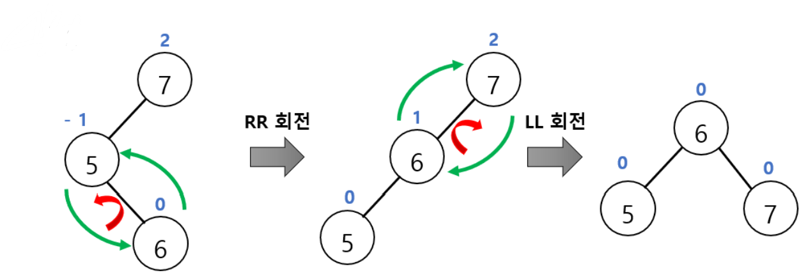
</p>

그래서 LR 타입도 RL 타입처럼 한 번의 회전으로는 균형을 복구할 수 없으므로 **두 번의 회전**을 수행한다.

<p align="center">
  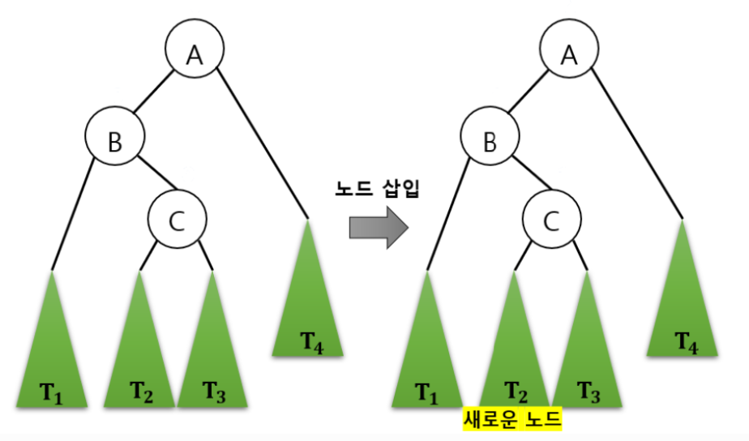
</p>

<p align="center">
  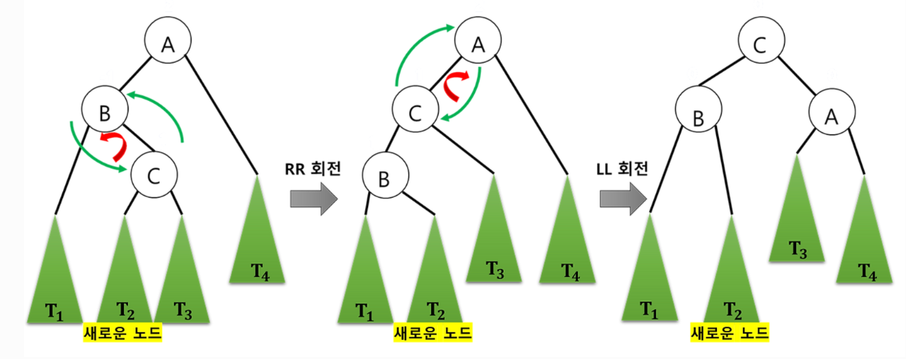
</p>

```python
def LR_Rotation(A):
    B = A.left
    A.left = RRRotation(B)
    return LLRotation(A)
```

네 가지 유형을 하나의 함수로 처리할 수 있다. 먼저 현재 노드의 균형 인수로 **어느 쪽이 무거운지** 판단하고, 그다음 **무거운 쪽 자식의 균형 인수**로 단일/이중 회전을 구분한다.

```python
def rebalance(node):
    update_height(node)
    bf = balance_factor(node) # 균형 인수 계산
    
    # 왼쪽이 오른쪽보다 더 길 때
    if bf > 1:                                  
        if balance_factor(node.left) >= 0:
            return ll_rotation(node) #  LL
        return lr_rotation(node) # LR

    # 왼쪽보다 오른쪽이 더 길 때
    if bf < -1:                                 
        if balance_factor(node.right) <= 0:
            return rr_rotation(node) # RR
        return rl_rotation(node) # RL

    return node   
```

### #11.3 AVL 트리의 삽입 연산

새 노드가 삽입되면 **삽입 위치부터 루트까지의 경로에 있는 모든 조상**의 균형 인수가 영향을 받는다. 그래서 재귀 호출이 되돌아 나오는 길에 각 노드에서 `rebalance`를 호출한다.

```python
def insert(node, new_node):
    if node is None:
        return new_node

    if new_node.key < node.key:
        node.left = insert(node.left, new_node)
    elif new_node.key > node.key:
        node.right = insert(node.right, new_node)
    else:
        node.value = new_node.value  # 중복 key → 값만 갱신
        return node

    return rebalance(node)          
```

### #11.4 AVL 트리의 삭제 연산
AVL 트리의 삭제 연산은 먼저 일반 BST와 동일한 방법으로 노드를 삭제한다. 

이후 삭제로 인해 서브트리의 높이가 감소하면서 AVL의 균형 조건이 깨질 수 있으므로, 삭제된 위치에서 루트 방향으로 올라가며 각 조상 노드의 균형 인수를 확인한다. 균형 인수의 절댓값이 1을 초과하면 LL, LR, RR, RL 유형에 맞는 회전을 수행하여 균형을 복구한다. 

```python
def find_min(node):
    while node.left is not None:
        node = node.left
    return node


def delete(node, key):
    if node is None:
        return None

    if key < node.key:
        node.left = delete(node.left, key)
    elif key > node.key:
        node.right = delete(node.right, key)
    else:
        if node.left is None:                  
            return node.right
        if node.right is None:                  
            return node.left

        successor = find_min(node.right)        
        node.key = successor.key
        node.value = successor.value             
        node.right = delete(node.right, successor.key)

    return rebalance(node)
```

**삭제는 한 번의 회전으로 끝나지 않을 수 있다.** 재조정된 서브트리의 높이가 삭제 이전보다 **1 줄어들 수 있기 때문**이다. 그러면 그 위 조상에서 다시 불균형이 생기고, 이것이 루트까지 연쇄될 수 있다.

그래서 삭제에서는 **루트에 도달할 때까지 계속 균형을 확인해야 한다.** 위 코드에서 매 재귀 반환마다 `rebalance`를 호출하는 것이 이 처리에 해당한다.

---

## #12. 힙 (Heap)

heap(또는 binary heap)은 **complete binary tree 기반의 자료구조로, 최댓값 또는 최솟값을 빠르게 꺼내기 위해 만들어진 구조**이다.

### #12.1 힙의 두 가지 조건

힙은 다음 두 조건을 **동시에** 만족하는 이진 트리다.

**(1) 완전 이진 트리여야 한다**

노드가 위에서 아래로, 왼쪽에서 오른쪽으로 빈틈없이 채워져 있어야 한다. 이 조건 덕분에 **배열로 구현했을 때 빈 자리가 전혀 생기지 않는다.** (#8.8에서 본 배열 표현법의 메모리 낭비 문제가 힙에서는 발생하지 않는다.)

**(2) 부모와 자식 사이에 대소 규칙이 있다**

힙에서 보장되는 것은 **부모-자식 관계뿐**이다.

부모 노드와 자식 노드 사이에만 대소 관계가 성립하면 된다.

### #12.2 힙은 "느슨한 정렬" 상태다

```
        9
      /   \
     7     8          ← 7과 8의 순서는 보장되지 않는다.
    / \   /             (8이 7보다 큰데도 오른쪽에 있음)
   3   5 6            ← 6이 3, 5보다 큰데도 더 오른쪽 아래에 있음
```

이 트리는 정상적인 최대 힙이다. 하지만 전체적으로는 전혀 정렬되어 있지 않다.
- 큰 값일수록 위쪽 레벨에, 작은 값일수록 아래쪽 레벨에 있는 **대략적인 경향**만 유지된다. 이를 **느슨한 정렬**이라고 한다.
- 즉, **힙은 정렬된 자료구조가 아니다.**
- 대신 **루트는 반드시** 전체에서 가장 큰(또는 가장 작은) 값이다. 그래서 힙은 "**최댓값/최솟값 하나만 빠르게**"에 특화된 구조다.

힙은 최대 힙(max heap)과 최소 힙(min heap)으로 나뉜다.

### #12.3 최대 힙과 최소 힙

**max heap**은 부모 노드의 key 값이 자식 노드의 key 값보다 크거나 같은 완전 이진 트리이다: $\text{key(부모 노드)} \ge \text{key(자식 노드)}$

**min heap**은 부모 노드의 key 값이 자식 노드의 key 값보다 작거나 같은 완전 이진 트리이다: $\text{key(부모 노드)} \le \text{key(자식 노드)}$

```
   [max heap]              [min heap]
        9                       1
      /   \                   /   \
     7     8                 3     2
    / \   /                 / \   /
   3   5 6                 7   5 6
```

max heap에서는 루트 노드에 가장 큰 key 값이, min heap에서는 가장 작은 key 값이 오게 된다.

그러므로 값이 **큰 순서대로** 처리하려면 max heap을, 값이 **작은 순서대로** 처리하려면 min heap을 이용한다.

### #12.4 배열로 구현하기
힙은 완전 이진 트리이므로, **빈 칸이 생기지 않는다.** 그래서 힙은 배열 하나로 구현하는 것이 일반적이다.

```
        9(1)
      /     \
    7(2)    8(3)
    /  \    /
  3(4) 5(5) 6(6)

index:  0     1     2     3     4     5     6
      [  -  ][ 9 ][ 7 ][ 8 ][ 3 ][ 5 ][ 6 ]
       미사용
```
- 부모: $\lfloor i/2 \rfloor$, 왼쪽 자식: $2i$, 오른쪽 자식: $2i+1$ (index 1부터 사용 시)
- 마지막 노드 = 배열의 마지막 원소 → **새 노드를 넣을 자리와 뺄 자리를 $O(1)$에 알 수 있다.**

### #12.5 삽입 

1. 새 노드를 **완전 이진 트리의 마지막 자리**(= 배열의 맨 끝)에 추가한다.
2. 부모와 비교해서 순서 조건을 위배하면(최대 힙에서 부모보다 크면) 부모와 자리를 바꾼다.
- 한 번 비교할 때마다 한 레벨씩 올라가므로 최대 이동 거리는 트리의 높이다. 
3. 조건을 만족하거나 루트에 도달할 때까지 2를 반복한다.

### #12.6 삭제

힙에서 삭제는 항상 **루트 노드**를 대상으로 한다. (최댓값/최솟값을 꺼내는 것이 힙의 목적이므로)

1. 루트 노드를 꺼내 반환한다.
2. **마지막 노드**를 루트 자리로 옮긴다.
3. 자식들 중 더 큰 쪽(최대 힙 기준)과 비교해서 순서 조건을 위배하면 교환하며 내려간다.
4. 조건을 만족하거나 리프에 도달할 때까지 3을 반복한다.

마찬가지로 최대 이동 거리가 트리의 높이이다. 

### #11.7 Python의 `heapq`

Python의 `heapq`는 **최소 힙만** 제공한다.

```python
import heapq

h = []
# 삽입
heapq.heappush(h, 5)      
heapq.heappush(h, 1)
heapq.heappush(h, 3)

h[0] # peek      

# 최솟값(루트) 삭제하고 그 값을 반환 
heapq.heappop(h)          

arr = [5, 1, 3, 8]
heapq.heapify(arr)        # 배열을 힙으로 O(n)
```

Python의 `heapq`는 최소 힙이므로, 값에 음수 부호(-)를 붙여 저장하면 최대 힙처럼 사용할 수 있다.

```python
heapq.heappush(h, -x)     # 넣을 때 음수로
-heapq.heappop(h)         # 꺼낼 때 다시 양수로
```
- 원래 값이 클수록 음수로 바꿨을 때 더 작은 값이 되므로, 가장 큰 원래 값이 힙의 맨 위에 오게 된다. 
- 값을 꺼낼 때 다시 음수 부호를 붙이면 원래 값을 얻을 수 있다.

### #12.7 우선순위 큐 (Priority Queue)

**우선순위 큐는 "우선순위가 가장 높은 항목이 먼저 나오는 큐"라는 ADT**이고, **힙은 그것을 구현하는 자료구조**다.

- 일반 큐: **먼저 들어온 것**이 먼저 나온다 (FIFO)
- 우선순위 큐: **우선순위가 가장 높은 것**이 먼저 나온다 (들어온 순서와 무관)

힙은 가장 큰(혹은 가장 작은) key를 가지는 노드가 항상 루트에 위치한다. 이 성질을 그대로 응용하면 우선순위 큐가 된다. **key를 값 자체가 아니라 "우선순위"로 두면**, 루트에는 항상 우선순위가 가장 높은 항목이 오기 때문이다.

우선순위 큐는 배열이나 연결 리스트로도 구현할 수 있지만, 어느 한쪽 연산이 반드시 느려진다.

| 구현 방식 | 삽입 | 삭제(최우선 항목 꺼내기) |
|:---|:---:|:---:|
| `정렬 안 된 배열/리스트` | $O(1)$ | $O(n)$ (전부 탐색해 최댓값을 찾아야 함) |
| `정렬된 배열/리스트` | $O(n)$ (자리를 찾아 끼워 넣어야 함) | $O(1)$ |
| **`힙`** | $O(\log n)$ | $O(\log n)$ |

정렬 방식들은 한쪽이 $O(1)$인 대신 다른 쪽이 $O(n)$이라 **어느 한 연산에 몰리면 급격히 느려진다.** 반면 힙은 두 연산 모두 **최악의 경우에도 $O(\log n)$이 보장**되어 균형이 잡혀 있다. 그래서 우선순위 큐를 구현하는 가장 일반적이고 좋은 방법이 힙이다.

단, 힙 기반 우선순위 큐는 **불안정(unstable)** 하다. 우선순위가 같은 항목 여러 개가 있을 때, 먼저 넣은 것이 먼저 나온다는 보장이 없다. 

삽입 순서를 지키고 싶다면 `(우선순위, 삽입순번, 데이터)` 형태의 튜플로 넣어 순번을 2차 기준으로 삼는다.

```python
import heapq
import itertools

pq = []
counter = itertools.count()

heapq.heappush(pq, (2, next(counter), "A"))
heapq.heappush(pq, (1, next(counter), "B"))
heapq.heappush(pq, (1, next(counter), "C"))
heapq.heappush(pq, (3, next(counter), "D"))

print(pq)

while pq:
    priority, count, item = heapq.heappop(pq)
    print(priority, count, item)

>>
[(1, 1, 'B'), (2, 0, 'A'), (1, 2, 'C'), (3, 3, 'D')]
1 1 B
1 2 C
2 0 A
3 3 D
```

---

## #13. 그래프 (Graph)

그래프는 **정점(vertex)과 간선(edge)으로 객체 간의 관계를 표현하는 자료구조**이다.

- **정점(vertex, node)**: 객체를 나타낸다.
- **간선(edge)**: 정점 간의 연결 관계를 나타낸다.

그래프는 $G = (V, E)$로 표기한다. $V$는 정점의 집합, $E$는 간선의 집합이다.

> **트리와의 관계**: 트리는 그래프의 특수한 경우다. **사이클이 없고 연결된 무방향 그래프**가 트리이며, 간선 수가 정확히 $n-1$개다. 그래프는 이런 제약이 없어서 사이클도, 끊어진 부분도, 방향도 있을 수 있다.

### #13.1 그래프의 종류

#### (1) 무방향 그래프 (undirected graph)

간선에 방향이 없는 그래프. 따라서 하나의 간선은 특정한 방향이 없으므로 양방향으로 갈 수 있는 길을 의미한다.

간선 $(A, B)$와 $(B, A)$는 **같은 간선**이다. 양방향 통행이 가능하다고 보면 된다.

```
    A ─── B
    │   ╱ │
    │  ╱  │
    C ─── D

V = {A, B, C, D}
E = {(A,B), (A,C), (B,C), (B,D), (C,D)}
```

무방향 그래프는 **모즌 정점들이 서로 연결되어 있을 때** 최대 간선 수는 $\dfrac{n(n-1)}{2}$
- 무방향 그래프에서는 두 정점 사이에 한 개의 간선만 존재할 수 있다.
- $n$개의 정점이 있을 때, 첫 번째 정점은 $n-1$개의 정점과 연결될 수 있고, 두 번째 정점은 첫 번째 정점과 이미 연결되어 있으므로 $n-2$개의 정점과 연결될 수 있다. 세 번째 정점은 첫 번째와 두 번째 정점과 연결되어 있으므로 나머지 $n-3$개의 정점과 연결될 수 있다. $n-1$번째 정점은 나머지 한 개의 정점과 연결될 수 있고, 마지막 $n$번째 정점은 이미 모든 정점과 연결되어 있으니 더 이상 연결할 수 있는 정점이 존재하지 않는다.
- 그러므로, 모든 정점들이 서로 연결되어 있을 때, 각 정점에서 가질 수 있는 최대 간선의 수를 모두 더하면 $(n-1) + (n-2) + ... + 1 = \frac{n(n-1)}{2}$

#### (2) 방향 그래프 (directed graph, digraph)

간선에 방향이 있는 그래프. 방향을 나타내기 위해 간선을 화살표로 나타낸다. 방향 그래프에서 간선은 무방향 그래프와 다르게 한쪽 방향으로만 갈 수 있다. 

$\langle \text{A}, \text{B} \rangle$는 A에서 B로 가는 간선이며, $\langle \text{B}, \text{A} \rangle$와 **다른 간선**이다. 
- $\langle \text{A}, \text{B} \rangle$: 정점 A에서 정점 B로만 가는 간선,
- $\langle \text{B}, \text{A} \rangle$: 정점 B에서 정점 A로만 가는 간선을 의미하기 때문에 
- $\langle \text{A}, \text{B} \rangle$와 $\langle \text{B}, \text{A} \rangle$는 서로 다른 간선이다.

```
    A ──→ B
    ↑     │
    │     ↓
    C ←── D

E = {<A,B>, <B,D>, <D,C>, <C,A>}
```

방향 그래프는 두 정점 사이에 두 방향의 간선이 모두 존재할 수 있다. 그러므로 최대 간선 수는 무방향 그래프의 2배이다: $n(n-1)$


#### (3) 가중치 그래프 (weighted graph, network)

간선에 비용·거리·시간 등의 값(가중치)이 부여된 그래프이며 네트워크라고도 한다. 
```
       7
    A ─── B
  4 │     │ 2
    │     │
    C ─── D
       5
```

#### (4) 부분 그래프 (subgraph)

원래 그래프의 정점과 간선의 **일부**로 이루어진 그래프.

<p align="center">
  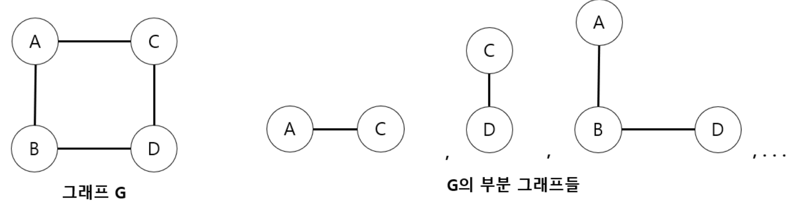
</p>


### #13.2 그래프 관련 용어

```
    A ─── B
    │   ╱ │
    │  ╱  │
    C ─── D
```

- `인접 정점 (adjacent vertex)`: 하나의 간선으로 **직접 연결된** 정점. (A의 인접 정점은 B, C)
- `정점의 차수 (degree)`: 그 정점에 연결된 **간선의 수**. (B의 차수 = 3)
  - 방향 그래프에서 정점의 차수는 두 가지로 나뉜다: **진입 차수(in-degree)** 는 들어오는 간선 수, **진출 차수(out-degree)** 는 나가는 간선 수다.
- `경로 (path)`: 정점 $v_0$에서 $v_k$까지, 연속한 두 정점이 간선으로 이어져 있는 정점들의 나열 $v_0, v_1, \dots, v_k$. (A → C → D는 경로)
- `경로의 길이 (length)`: 그 경로를 구성하는 **간선의 개수**. (A → C → D의 길이는 2)
- `단순 경로 (simple path)`: 경로 중에서 **반복되는 정점이 없는** 경로. 단, 시작 정점과 끝 정점이 같은 것은 허용한다.
- `사이클 (cycle)`: **시작 정점과 끝 정점이 같은 단순 경로**. (A → B → C → A)
- `연결 그래프 (connected graph)`: 모든 정점 쌍 $(u, v)$에 대해 $u$에서 $v$로 가는 경로가 **항상 존재하는** 그래프. 즉, 모든 정점들이 연결된 그래프.
    - 트리는 **사이클을 가지지 않는 연결 그래프**. 연결 그래프에서 사이클이 없으면 두 정점을 연결하는 간선은 하나뿐이므로 트리 모양이 된다. 
- `완전 그래프 (complete graph)`: **모든 정점 사이에 간선이 존재하는 그래프**
  - 무방향 및 방향 그래프가 완전 그래프 형태이고, 정점 개수가 $n$개라면, 
  - 무방향 간선의 수: $\dfrac{n(n-1)}{2}$개 
  - 방향 간선의 수: $n(n-1)$개 

### #13.3 그래프 표현 방법

그래프는 다양한 방법으로 표현할 수 있으며, 어떻게 그래프를 표현하느냐에 따라 그래프의 연산을 위한 시간복잡도가 달라질 수 있다.

#### (1) 인접 행렬 (adjacency matrix)

정점이 $n$개일 때 $n \times n$ 크기의 2차원 배열로 표현한다. `M[i][j]`가 1이면 정점 $i$에서 $j$로 가는 간선이 존재한다는 뜻이다. 0이면 존재하지 않는다는 뜻.

```
    A ─── B                A  B  C  D
    │   ╱ │            A [ 0  1  1  0 ]
    │  ╱  │            B [ 1  0  1  1 ]
    C ─── D            C [ 1  1  0  1 ]
                       D [ 0  1  1  0 ]
```

- **무방향 그래프의 인접 행렬은 대각선을 기준으로 대칭(symmetric)** 이다. `M[i][j] == M[j][i]`이기 때문이다. 방향 그래프는 대칭이 아니다.
- **가중치 그래프**라면 1 대신 **가중치 값**을 저장한다. 이때 간선이 없는 곳은 **0이 아니라 `INF`(무한대)로 두어야 한다.** 0을 쓰면 "가중치가 0인 간선"과 "간선 없음"을 구분할 수 없기 때문이다.

```
가중치 그래프의 인접 행렬 (INF = 간선 없음)

        A    B    C    D
   A [  0    7    4   INF ]
   B [  7    0   INF   2  ]
   C [  4   INF   0    5  ]
   D [ INF   2    5    0  ]
```

#### (2) 인접 리스트 (adjacency list)

각 정점마다 **자신과 인접한 정점들의 목록**을 연결 리스트(또는 동적 배열)로 저장한다.

```
    A ─── B            A → [B, C]
    │   ╱ │            B → [A, C, D]
    │  ╱  │            C → [A, B, D]
    C ─── D            D → [B, C]
```

가중치 그래프라면 `(인접 정점, 가중치)` 쌍을 저장한다.

```
A → [(B, 7), (C, 4)]
B → [(A, 7), (D, 2)]
C → [(A, 4), (D, 5)]
D → [(B, 2), (C, 5)]
```

그래프는 선형 자료구조가 아니기 때문에 정점들의 순서는 의미가 없다. 딕셔너리나 집합을 이용해서 인접 리스트로 표현할 수 있다.

```python
graph = {
    'A': [('B', 7), ('C', 4)],
    'B': [('A', 7), ('D', 2)],
    'C': [('A', 4), ('D', 5)],
    'D': [('B', 2), ('C', 5)],
}
```

**어느 것을 쓸까**

- $V$가 정점의 개수, $E$가 간선의 개수라고 하자.
- **희소 그래프(sparse graph)** — 간선이 적어 $E \ll V^2$인 경우 → **인접 리스트**
  - 인접 행렬은 대부분의 칸이 0으로 채워져 메모리가 크게 낭비된다. 
- **밀집 그래프(dense graph)** — 간선이 많아 $E \approx V^2$인 경우 → **인접 행렬**

> 순회 비용의 차이가 핵심이다. DFS/BFS는 각 정점에서 인접 정점을 모두 훑는데, 인접 행렬은 간선이 없어도 $V$칸을 전부 확인해야 해서 $O(V^2)$가 되지만, 인접 리스트는 실제 존재하는 간선만 보므로 $O(V + E)$가 된다.

---

## 전체 시간복잡도 요약

| 자료구조 | 접근 | 탐색 | 삽입 | 삭제 |
|:---|:---:|:---:|:---:|:---:|
| `배열 (Array)` | $O(1)$ | $O(N)$ | $O(N)$ | $O(N)$ |
| `연결 리스트 (Linked List)` | $O(N)$ | $O(N)$ | $O(1)$* | $O(1)$* |
| `해시 테이블 (Hash Table)` | — | $O(1)$ 평균 | $O(1)$ 평균 | $O(1)$ 평균 |
| `스택 (Stack)` | top만 $O(1)$ | $O(N)$ | $O(1)$ | $O(1)$ |
| `큐 (Queue)` | front만 $O(1)$ | $O(N)$ | $O(1)$ | $O(1)$ |
| `덱 (Deque)` | 양 끝만 $O(1)$ | $O(N)$ | 양 끝 $O(1)$ | 양 끝 $O(1)$ |
| `이진 탐색 트리 (BST)` | — | $O(\log N)$ 평균 | $O(\log N)$ 평균 | $O(\log N)$ 평균 |
| `AVL 트리` | — | $O(\log N)$ 보장 | $O(\log N)$ 보장 | $O(\log N)$ 보장 |
| `힙 (Heap)` | 루트만 $O(1)$ | $O(N)$ | $O(\log N)$ | $O(\log N)$ |

스택·큐·덱의 삽입/삭제는 **정해진 끝에서 수행할 때** $O(1)$이며, 해시 테이블과 일반 BST는 최악의 경우 $O(N)$이다. 힙의 삭제는 **루트(최댓값/최솟값) 삭제** 기준이다.
그래프는 표현 방식에 따라 달라진다. 

---
